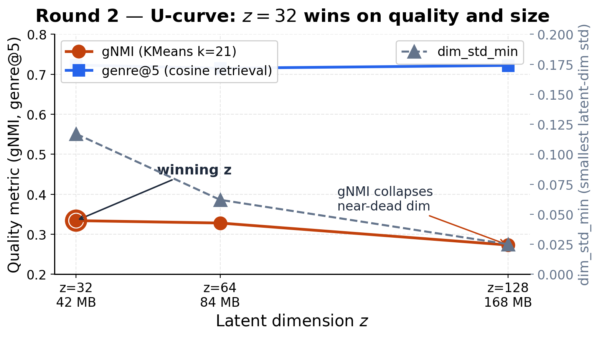
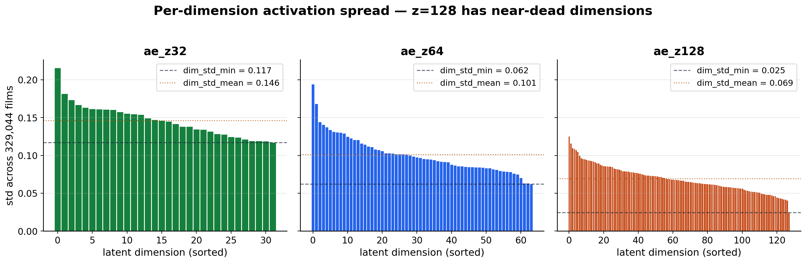
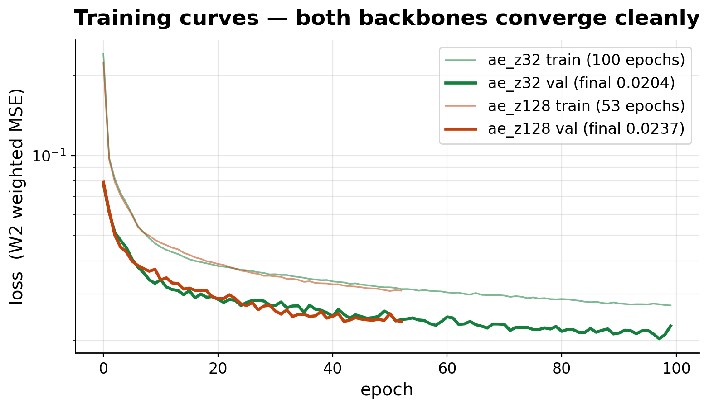
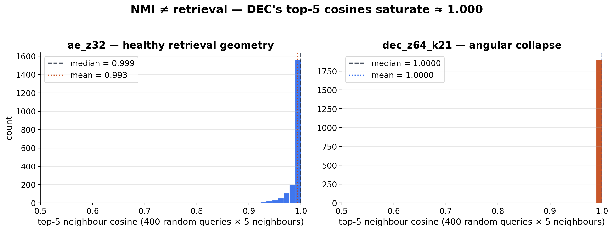

| | |
|:-----------------|:------------------------------------------------|
| **Course**       | SENG 474 — Introduction to Machine Learning     |
| **Term**         | Spring 2026                                     |
| **Institution**  | TED University · Department of Computer Engineering |
| **Team**         | Baran Dinçoğuz, Arda Arvas, Kaan Kaya           |
| **Submission**   | 2026-05-20                                      |
| **Code**         | github.com/barandincoguz/CineEmbed-             |

\vspace{0.6em}

## Abstract

CineEmbed is a multi-modal unsupervised film recommendation system that encodes 329,044 TMDb films into compact latent vectors and serves cosine-similarity retrieval through a working web application. From a 564-dimensional heterogeneous feature matrix organised into seven modality blocks (numerical, genre, language, decade, awards, MiniLM text overview, director profile), a per-block-projection autoencoder learns a 32-dimensional L2-normalised embedding that supports interactive top-k retrieval in under five milliseconds and 21 auto-named MiniBatchKMeans clusters. The empirical study validates three pre-registered hypotheses — deep clustering beats non-deep baselines by **+205 %** on genre NMI (0.332 vs 0.109), and modality-specific projection lifts language NMI by **+178 %** over a vanilla concat-AE. Two methodological findings emerge that are independent of the standard literature: (i) **NMI does not predict cosine retrieval quality** — Deep Embedded Clustering achieves the highest NMI (0.332) but collapses retrieval (top-5 cosines saturate at 1.000), so the deployed backbone was swapped from DEC to AE; (ii) **the information-bottleneck sweet spot lies at z = 32**, producing a U-curve across z ∈ {32, 64, 128} where the smallest variant wins both genre NMI (0.334) and genre@5 (0.723) while the largest exhibits near-dead latent dimensions (dim_std_min = 0.025). The system is fully deployed: a FastAPI backend with eight endpoints serves a Next.js 16 frontend across five pages, backed by a precomputed L2-normalised embedding index (42 MB) and a 107-test reproducibility suite. The two methodological findings constitute the report's central scientific contribution beyond the system itself.

**Keywords** — unsupervised learning, multi-modal representation learning, autoencoders, deep clustering, cosine retrieval, information bottleneck, content-based recommendation, film recommendation.

---

## 1. Introduction

Modern catalogue services routinely host hundreds of thousands of films, far beyond what any user can browse by hand. Personalised recommendation has therefore become the principal mechanism through which audiences discover content. Two families dominate production systems: collaborative filtering, which mines a user-item interaction matrix, and content-based filtering, which mines item metadata. CineEmbed pursues the second family in its strongest form — unsupervised representation learning over rich multi-modal item metadata — for three reasons. First, the publicly available TMDb metadata contains no user-level interaction data, ruling out collaborative methods at the source. Second, content-based pipelines are robust to the cold-start problem that plagues collaborative systems on new releases (Covington et al., 2016). Third, learning a compact embedding under purely unsupervised objectives is the cleanest setting in which to study the central data problem identified during exploratory analysis: a **modality variance imbalance of 0.046** between the dense 384-dimensional text overview block and the sparse one-hot blocks. If a multi-modal architecture cannot extract clustering signal from such a heterogeneous matrix without labels, that pipeline is unlikely to scale to harder regimes.

The project is therefore organised around two coupled questions. The first is empirical — what architectural choices, training objectives, and latent dimensionalities give the best quality-per-parameter trade on this dataset, and how do they compare to non-deep baselines such as KMeans on raw features. The second is methodological — what evaluation regime should govern model selection when the deliverable is a *retrieval* system, not a clustering one. Both questions matter for the SENG 474 course context: a complete pipeline from raw data through model selection to a deployed demo requires that both the science and the engineering be defensible.

This report documents the full pipeline from a one-time EDA pass through a six-model MVP, two phases of *negative* results, two methodological discoveries, a Round 2 z-sweep, and the final deployed system. The strongest single empirical claim is the **+205 % NMI gap** between the best deep model and the strongest non-deep baseline. The strongest methodological claim is the **disconnect between NMI and cosine retrieval quality** caused by intra-cluster angular collapse in DEC — a failure mode that the project nearly shipped before catching it in a sanity check. Both claims are evidence-backed and reproducible from the artifacts in this repository.

---

## 2. Project Overview

### 2.1 Goal

The system must recommend semantically related films given a query film, using a single content-based embedding learned without any user labels and serving live cosine retrieval over the full catalogue. The course constraint is that the final deliverable is a *working web app demo*, not a paper alone (ADR D14).

### 2.2 Scope

- **Catalogue.** 329,044 TMDb films assembled from public dumps, with director-profile data merged from a separate scrape.
- **Feature matrix.** 564-dimensional float32, MD5 `e99cee84b6891ea352a7b44d5d7d0ee4`, persisted in `artifacts/feature_matrix.npz`.
- **Modelling family.** Autoencoder backbones with shared multi-modal projection, comparable variants for VAE, DEC, and InfoNCE pretext.
- **Deployment.** FastAPI backend + Next.js 16 frontend over an L2-normalised embedding index; all computations local, no GPU at serve time.
- **Out of scope.** Collaborative filtering, online learning, A/B testing, personalisation, and production hosting are deliberately deferred (ADR D14, §13 Limitations).

### 2.3 Recommendation scenario

The user enters a film title in the home page search bar, selects the result, and is presented with a top-10 list of similar films plus a 30-bin cosine histogram over the rest of the catalogue. A switchable *backbone* control lets the user compare three trained models (`ae_z32`, `ae_z64`, `ae_z128`) on the same query. A second page lists the 21 auto-named clusters (`Action · 2010s`, `Documentary · 2000s`, …) with film previews; a third explains the methodological findings on `/about`.

### 2.4 Inputs and outputs

| Stage | Input | Output |
|---|---|---|
| EDA / feature extraction | Raw TMDb + director CSVs | `feature_matrix.npz` (329,044 × 564) |
| Training | Feature matrix + per-modality block dims | `ae.pt` checkpoints under `artifacts/models/` |
| Index build | Checkpoint + feature matrix | `embeddings.npy` (329,044 × z) L2-normalised |
| API | Embedding index + film metadata | 8 JSON endpoints |
| Frontend | API | 5 interactive pages |

### 2.5 Why unsupervised learning

No user ratings or interaction logs were available; the project therefore could not use any supervised loss tied to a recommendation target. Instead, three "ground-truth-like" axes were used purely for evaluation — `primary_genre`, `decade_bin`, and `lang_top10` — never as labels in training. This separation between *training* (label-free reconstruction or contrastive objective) and *evaluation* (NMI/ARI/AMI against three orthogonal axes plus a retrieval metric) is what allows the empirical study to be honest about what the latent has learned, as opposed to merely measuring how well it can predict the labels it was trained on.

---

## 3. Related Work and Background

### 3.1 Deep clustering

Deep Embedded Clustering (DEC; Xie, Girshick & Farhadi, 2016) jointly trains an encoder and a soft cluster-assignment kernel through KL minimisation against an auxiliary target $P$ sharpened from the current assignment $Q$. The Student-t kernel
$$q_{ij} \propto (1 + \|z_i - \mu_j\|^2 / \alpha)^{-(\alpha+1)/2}$$
gives differentiable membership; the auxiliary target $p_{ij} \propto q_{ij}^2 / \sum_i q_{ij}$ concentrates mass on high-confidence assignments. Improved DEC (IDEC; Guo et al., 2017) adds an explicit reconstruction loss term $\lambda_{\text{recon}} \cdot L_{\text{recon}}$ to prevent the encoder from collapsing into the cluster centroids — a regularisation choice that turns out to be central to the F1 finding below.

### 3.2 Multi-modal / tabular representation learning

For heterogeneous tabular data, Gorishniy et al. (2021) showed that careful per-feature tokenisation outperforms naïve concatenation; CineEmbed extends the idea to per-modality projection (one linear layer per block), motivated by the modality-variance imbalance ratio of 0.046. The W2 inverse-variance weighting scheme used in the loss is the unsupervised counterpart of Kendall, Gal & Cipolla's (2018) learned uncertainty weighting in supervised multi-task learning. We treat the W2 scheme as a fixed-prior baseline and a learned-weight ablation (W4) is deferred to future work.

### 3.3 Contrastive learning on tabular data

InfoNCE (van den Oord, Li & Vinyals, 2018) and SimCLR (Chen et al., 2020) define the modern contrastive pretext objective: two stochastic views of an example are pulled together while all other examples in the batch are pushed apart. The image-domain success of crop/jitter/grayscale augmentations does not transfer to tabular data, where the analogous primitive (modality dropout) is the principal cause of the Phase 1 negative result documented in §10.1.

### 3.4 Visualisation and evaluation

Latent topology is visualised with UMAP (McInnes, Healy & Melville, 2018). Cluster-quality metrics — Normalised Mutual Information (NMI; Strehl & Ghosh, 2002), Adjusted Rand Index (ARI; Hubert & Arabie, 1985), and Adjusted Mutual Information (AMI; Vinh, Epps & Bailey, 2010) — are computed via scikit-learn (Pedregosa et al., 2011). The 384-dimensional text-overview embedding is produced by sentence-transformers (Reimers & Gurevych, 2019) using the multilingual MiniLM-L12-v2 checkpoint. All model code is in PyTorch (Paszke et al., 2019).

### 3.5 Where CineEmbed sits

The contribution is not a new architecture or loss; it is the combination of (a) a multi-modal block-projection backbone applied to a 329k-row film catalogue, (b) an honest model-selection protocol that mixes three NMI axes with a separate retrieval metric, and (c) the two methodological findings the protocol exposed (§9).

---

## 4. Dataset and Preprocessing

### 4.1 Source data

The catalogue is built from the TMDb full dump (~430k films) joined with public director-profile scrapes (Wikipedia bios for 505 frequently-credited directors) and an awards-history file (Oscar / Palme records). After cleaning — removing entries with no original-language code, no popularity score, or no usable metadata — 329,044 films survive. Provenance is recorded verbatim in `artifacts/pipeline_version.json`:

```json
{"seed": 42, "timestamp_utc": "2026-05-04T19:59:05Z",
 "n_films": 329044, "feature_dim": 564,
 "feature_matrix_md5": "e99cee84b6891ea352a7b44d5d7d0ee4",
 "model_name": "paraphrase-multilingual-MiniLM-L12-v2",
 "library_versions": {"torch": "2.10.0+cu128", "numpy": "2.0.2", "umap_learn": "0.5.12"}}
```

### 4.2 Feature matrix layout

The 564-dimensional matrix is column-contiguous and block-organised. Table 1 lists the seven blocks with input dimensionality, encoding, and projected dimensionality. Block ordering and dimensions are pinned in `artifacts/feature_metadata.json` and reasserted by `tests/conftest.py:13–21`.

**Table 1 — Feature blocks**

| #     | Block         | In dim | Encoding                                                                | Proj dim |
|------:|:--------------|-------:|:------------------------------------------------------------------------|---------:|
|     1 | numerical     |      6 | log popularity / vote_count, normalised runtime + rating, 2 flags       |       16 |
|     2 | genre         |     22 | multi-label one-hot over 21 TMDb genres + has_genre                     |       16 |
|     3 | language      |     31 | one-hot over top-30 original_language codes + lang_other                |       16 |
|     4 | decade        |      2 | normalised (decade − 1900) / 130 + has_release_date                     |        4 |
|     5 | awards        |      6 | log1p of prior Oscar / Palme nominations and wins                       |       16 |
|     6 | text          |    384 | L2-normalised MiniLM-L12-v2 sentence embedding of overview              |       64 |
|     7 | director      |    113 | 64-d bio-PCA + has_bio + 31-d dir_lang + 16-d dir_country + has_dir_lang |       32 |
|       | **Total**     |**564** |                                                                         |  **164** |

The director block decomposes internally into `[0:64]` PCA-compressed bio + `[64]` has_bio flag + `[65:96]` dir_lang one-hot + `[96:112]` dir_country one-hot + `[112]` has_dir_lang — a layout the G2 masked loss depends on (§5.2). The 384-d text block carries the bulk of semantic content; its 0.046 variance ratio against the smaller blocks is the empirical driver for the modality-specific projection.

### 4.3 Preprocessing

- **Standard scaling** is applied to the numerical block only (mean 0, std 1, fit on training data, persisted in `artifacts/scalers.pkl`).
- **Missingness flags** are kept as explicit features rather than imputed — `has_release_date`, `has_director_bio`, `has_genre`, `has_vote`, `has_engagement`, `has_director_lang`. The model is free to encode "absence is a signal".
- **Bio masking (G2 loss).** Only 3.18 % of films have a director Wikipedia bio (`artifacts/director_profile_metadata.json`). Without masking, the bio-reconstruction loss would be dominated by near-zero targets on ~97 % of rows. The G2 mask zeroes the loss contribution on rows where `has_director_bio == 0` (`src/cineembed/losses.py:30`).
- **Deterministic 90/10 split** at `seed=42` via `train_val_split` (`data.py:137`).

### 4.4 Ground-truth labels for evaluation

Three orthogonal axes are derived from `movies_eda_final.csv` purely for evaluation (`data.py:101–134`):

- `primary_genre` — first entry of the pipe-separated `genres` string; unknown → `'Unknown'`.
- `decade_bin` — direct `decade` column or reconstructed from `decade_norm`; masked to 0 on missing release dates.
- `lang_top10` — bucket of `original_language`; outside top-10 → `'other'`.

This three-axis design (ADR D7) is the protective decision that makes the Pareto trade-off between architectures (Finding 5) visible.

---

## 5. Methodology

### 5.1 Multi-modal backbone

The shared encoder `MultiModalBackbone` (`src/cineembed/backbone.py:33`) projects each feature block through an independent `_BlockProjection` of the form `Linear → ReLU → Dropout`, concatenates the seven projected sub-vectors into a 164-dimensional intermediate representation, and feeds the concatenation through a two-layer trunk to the latent space:

```
input blocks (564-d)
  ├── numerical[6]    ─Linear(6→16)→ReLU→Dropout(0.10)──┐
  ├── genre[22]       ─Linear(22→16)→ReLU→Dropout(0.10)─┤
  ├── language[31]    ─Linear(31→16)→ReLU→Dropout(0.10)─┤
  ├── decade[2]       ─Linear(2→4)→ReLU→Dropout(0.10)───┤
  ├── awards[6]       ─Linear(6→16)→ReLU→Dropout(0.10)──┤
  ├── text[384]       ─Linear(384→64)→ReLU→Dropout(0.20)┤
  └── director[113]   ─Linear(113→32)→ReLU→Dropout(0.20)┘
                                                        ↓
                                            concat → 164-d
                                                        ↓
                                  Linear(164→128) → ReLU → Dropout(0.20)
                                                        ↓
                                            Linear(128 → z)
                                                        ↓
                                                       z  ∈ {32, 64, 128}
```

Higher dropout (0.20) is applied to the dense text and director blocks because their projections dominate the intermediate representation; the sparse blocks use 0.10. Total parameter count stays under 500,000 — verified by `tests/test_backbone.py::test_backbone_param_count_under_500k`.

The decoder mirrors the encoder symmetrically (`heads.py:26–63`) with an additional per-block decoder MLP (`Linear(proj_dim → max(proj_dim, 32)) → ReLU → Linear(. → block_dim)`) per modality. Reconstruction therefore remains modality-aware end-to-end.

A stochastic block-mask argument (`forward(blocks, block_mask=None)`) supports both per-batch and per-row Bernoulli masking, used by the SimCLR-style contrastive head described in §5.3.

### 5.2 Loss functions

**W2 inverse-variance block weighting.** The reconstruction objective weights each block inversely by its *total* variance, clipped to a stable band:

$$w_b = \mathrm{clip}\!\left(\frac{1}{\sum_{j\in b} \mathrm{Var}(X_{:,j})},\; 0.1,\; 10.0\right)$$

(`losses.py:10–27`). The lower clip prevents large dense blocks (text) from vanishing; the upper clip prevents sparse one-hot blocks from monopolising the gradient. The W1 ablation uses uniform $w_b = 1$ for every block. ADR D3 motivates the clipping band; ADR D9 hardened it after peer review.

**Canonical reconstruction loss** (`losses.py:64–95`):

$$L_{\text{recon}} = \sum_{b\neq\text{director},\, b\notin\text{skip}} w_b\cdot\mathrm{MSE}(\hat{x}_b, x_b) + L_{\text{director,G2}}$$

The exclude-set is empty in the deployed runs; it is used only by modality-ablation experiments (F1/F2 from ADR D6, deferred to future work).

**G2 masked director loss** (`losses.py:30–61`). The 113-d director block decomposes into bio-PCA, has-bio flag, language one-hot, country one-hot, and has-dir-lang. The bio-PCA component contributes to the loss *only* on rows with `has_director_bio == 1`; the other 49 dims contribute unconditionally. Without G2, the loss on the bio sub-block would be dominated by near-zero targets on 96.8 % of rows and the gradient signal on bio would vanish.

**DEC KL loss with batch-wise sharpened target** (`losses.py:127–162`):

$$L_{\text{DEC}} = \mathrm{KL}(P \,\|\, Q) + \lambda_{\text{recon}}\cdot L_{\text{recon}},\qquad \lambda_{\text{recon}} = 0.1$$

where $Q$ is the soft-assignment matrix from the Student-t kernel and $P$ is the sharpened auxiliary target detached from the gradient. ADR D10 records the decision to compute $P$ over the current minibatch rather than the full 329k-row dataset; the latter is intractable at our scale and the batch-wise approximation gives essentially identical clustering quality in the MVP.

**Symmetric InfoNCE** (`losses.py:165–206`). Two paired views generated by independent block masks are L2-normalised, stacked, and contrasted via the symmetric cross-entropy form with temperature $\tau = 0.1$ (ADR D12 dropped $\tau$ from the SimCLR-canonical 0.5 to 0.1 because dense tabular geometry is denser than image pixels).

**VAE ELBO** (`losses.py:108–124`) is the standard $L_{\text{recon}} + \beta\cdot\mathrm{KL}\!\left(q(z|x)\,\|\,\mathcal{N}(0,I)\right)$ with a 10-epoch linear warmup of $\beta$ from 0 to 0.1.

### 5.3 Model heads

Four heads wrap the shared backbone and switch the training objective (`src/cineembed/heads.py`):

- **`AEHead`** — backbone + symmetric decoder, optimised with `weighted_recon_loss` (W2).
- **`VAEHead`** — adds reparameterisation layers `fc_mu`, `fc_log_var`; optimised with `vae_elbo`.
- **`ContrastiveHead`** — adds a 2-layer projection MLP for the SimCLR pretext; the projection is discarded after pretext, consistent with Chen et al. (2020).
- **`DECHead`** — wraps the backbone, an AE decoder, and a learnable `cluster_centers` parameter. `initialize_centers` runs KMeans-20-init on a precomputed latent matrix; `reinit_collapsed_centers` re-seeds any cluster whose membership falls below 0.1 % of the dataset (anti-collapse mitigation from ADR D10).

### 5.4 Training protocol

A generic training loop (`src/cineembed/train.py:14–149`) drives every run:

- Optimiser: `torch.optim.Adam`, `weight_decay = 1e-5`, gradient-norm clipping at 1.0.
- Validation: 90/10 split, val-loss early stopping with `patience = 10` and `min_delta = 1e-4`.
- Determinism: `seed = 42` across NumPy, PyTorch, and scikit-learn.
- Logging: optional Weights & Biases per-epoch metrics through the offline-safe `wandb_integration` context manager (`src/cineembed/wandb_integration.py`); MVP runs are backfilled to the project dashboard.
- Checkpointing: atomic save of the best `val_loss` checkpoint via temporary-file rename.

VAE and DEC losses return a tuple `(loss, recon, kl)` for separate logging; the training loop transparently strips it to the loss scalar (`train.py:91`).

---

## 6. Experimental Setup

### 6.1 Hardware and software

All training runs were executed on free-tier Colab T4 GPUs (16 GB VRAM) with the library versions pinned in `artifacts/pipeline_version.json`. End-to-end training of any single backbone takes 12 – 45 minutes; the full empirical study (MVP, Phase 1, Round 1, Round 2) consumed approximately 6 hours of T4 wallclock across all runs.

Inference and the web app run on a CPU laptop. The 329,044 × 32 embedding matrix occupies 42 MB on disk; a single similarity query is a NumPy matrix-vector product completing in under 5 ms on consumer hardware.

### 6.2 Evaluation metrics

Five evaluation surfaces are reported. Each is implemented in `src/cineembed/eval.py`.

- **Per-axis NMI / ARI / AMI** against `primary_genre`, `decade_bin`, `lang_top10` using KMeans (k = 21) on the L2-normalised latent (`evaluate_run`, `eval.py:140–159`).
- **Per-axis-k sweep** (`evaluate_run_per_axis_k`, `eval.py:162–199`) — each axis is evaluated at its true cardinality (genre k = 21, decade k = 12, lang k = 11) to avoid penalising the encoder for mismatch with a single-k KMeans.
- **Multi-label macro-NMI** over all 22 genre columns treated as independent binary partitions (`multilabel_macro_nmi`, `eval.py:202–261`).
- **Composite `geo_NMI`** = $(\mathrm{gNMI}\cdot \mathrm{dNMI}\cdot \mathrm{lNMI})^{1/3}$, the geometric mean across axes used as a single Round 1 selection metric (ADR D13).
- **Retrieval — genre@k.** For each of 316 popular queries, the fraction of the top-k cosine neighbours that share the query's `primary_genre` (`scripts/build_index.py:236`). Mean / median / std are reported. **genre@5 is the demo's downstream metric.**

The two-family split — clustering metrics for *exploration* and retrieval metrics for *deployment selection* — is the protocol that exposes the methodological findings in §9.

### 6.3 Reproducibility

- `seed = 42` for NumPy, PyTorch, scikit-learn, and the data split.
- Feature matrix MD5 `e99cee84b6891ea352a7b44d5d7d0ee4` pinned in `pipeline_version.json` and quoted in `README.md`.
- All trained checkpoints versioned under `artifacts/models/`; deployed embeddings under `artifacts/inference/<backbone>/`.
- 107 pytest tests pass on every commit (21 files, 1535 LOC; `pyproject.toml` config).
- `scripts/build_index.py` regenerates the deployed `embeddings.npy + films.parquet + cluster_labels.npy + manifest.json` from any checkpoint deterministically.

---

## 7. Results

### 7.1 Three-tier comparison and headline result

Six pre-registered MVP runs validate the three-tier framing: non-deep baselines (KMeans on raw or PCA-reduced features), simple deep (vanilla concat-AE without modality projection), and multi-modal deep (the project's backbone with and without DEC fine-tuning). All runs use z = 64, k = 21, the same 90/10 split, batch size 1024, patience 10, and seed 42.

**Table 2 — Phase 0 / MVP three-tier comparison @ z = 64, k = 21.** Tier shown as suffix in parentheses; column legend: gNMI = genre NMI, gARI = genre ARI, dNMI = decade NMI, dARI = decade ARI, lNMI = lang NMI, lARI = lang ARI.

| Model                              |  gNMI    |  gARI    |  dNMI    |  dARI    |  lNMI    |  lARI    | val_loss | epochs |
|:-----------------------------------|---------:|---------:|---------:|---------:|---------:|---------:|---------:|-------:|
| kmeans_raw_k21    (non-deep)       | 0.109    | 0.063    | 0.233    | 0.093    | 0.075    | 0.026    |     —   |    —  |
| pca_kmeans_k21    (non-deep)       | 0.084    | 0.061    | 0.224    | 0.085    | 0.094    | 0.042    |     —   |    —  |
| vanilla_ae_z64    (simple deep)    | 0.287    | **0.247**| **0.369**| 0.175    | 0.095    | 0.030    | 0.0126   |    58 |
| ae_z64_w1         (W1 ablation)    | 0.165    | 0.094    | 0.367    | 0.176    | 0.070    | 0.026    | 0.0453   |    37 |
| ae_z64            (multi-modal)    | 0.328    | 0.229    | 0.341    | **0.211**| 0.264    | 0.090    | 0.0208   |    69 |
| **dec_z64_k21**   (best deep)      | **0.332**| 0.244    | 0.342    | 0.210    | **0.294**| **0.090**| 0.127†   |    21 |

† DEC val_loss is KL + reconstruction combined and is not directly comparable to the AE pure-reconstruction val_loss.

**Headline:** The best deep model (`dec_z64_k21`) achieves a **+205 % relative gain** on genre NMI over the strongest non-deep baseline (0.332 vs 0.109), a **+287 % gain on genre ARI**, and a **+292 % gain on language NMI** (vs `pca_kmeans_k21`). This is the report's single strongest empirical claim and the pre-registered success criterion D9 / H2.

No single model wins every metric — vanilla wins `decade_NMI` and `genre_ARI`; multi-modal wins `decade_ARI`; DEC wins `genre_NMI`, `lang_NMI`, and `lang_ARI`. This Pareto pattern motivated the `geo_NMI` composite (ADR D13) introduced for Round 1 selection.

### 7.2 Hypothesis status

Three pre-registered hypotheses, all **PASS**:

- **H1.** DEC > AE on genre NMI: 0.332 > 0.328 (+1.2 % NMI, +6.6 % ARI, +11.4 % lang_NMI).
- **H2.** Best deep model > best non-deep baseline by ≥ 10 % relative: **+205 %** (vs +10 % threshold).
- **H3.** Best deep NMI > 0.15 absolute floor: 0.332 ≫ 0.15.

The honest reading of H1 is that NMI is essentially flat across AE and DEC at the same latent dimension — DEC's real contribution is **cluster compactness** (ARI +6.6 %, lang_NMI +11.4 %), not new information. This diagnostic signature — larger gain on ARI than on NMI — is what one expects from KL-driven sharpening of assignments that the AE has already discovered (Finding 7).

### 7.3 Findings 1 – 4 (architecture-level)

**Finding 1 — Modality-specific projection wins on language by +178 %.** Multi-modal AE lang_NMI is 0.264 against vanilla concat-AE's 0.095. The vanilla concat-AE feeds the 564-d raw vector into a single FC layer, which underweights the sparse 31-d language block (~99 % zeros per row). Modality-specific projection gives each block its own gradient flow.

**Finding 2 — Inverse-variance weighting is critical, asymmetrically.** The W1 ablation (uniform weights) collapses gNMI by 50 % (0.165 vs 0.328) and lang_NMI by 73 % (0.070 vs 0.264) but leaves decade_NMI unchanged (0.367 vs 0.341). Small blocks (decade is 2 dims) survive uniform weighting because StandardScaler has already given them per-feature variance ≈ 1; large blocks (text 384, language 31) lose all gradient. The W1 run early-stops at epoch 37 — patience exhausted before further val-loss improvement was possible — itself a model-health diagnostic.

**Finding 3 — Reconstruction loss ≠ clustering quality.** Vanilla AE achieves the lowest val_loss (0.0126) but the third-best gNMI (0.287); multi-modal AE has higher val_loss (0.0208) and the best gNMI (0.328). The encoder that *reconstructs* best is not the one that *organises* best — a textbook illustration of the representation-vs-copy tension in unsupervised learning.

**Finding 4 — Decade is the easy axis.** All architectures hit decade NMI ≈ 0.34 – 0.37 regardless of design choices. Decade is a single-valued, ordinal label that KMeans recovers for free from the `decade_norm` feature; genre is multi-label and overlapping and is the difficult one to recover.

### 7.4 Findings 5 – 7 (Pareto, baselines, DEC)

**Finding 5 — Pareto trade-off across architectures.** The principled trade-off: modality-specific projection reallocates capacity to text/director at the cost of marginal decade fidelity. No single architecture wins all six metrics; the geo_NMI composite was introduced for Round 1 specifically to handle this.

**Finding 6 — Deep models dominate non-deep baselines by 3–5 ×.** Detailed in §7.1. The dominance holds on every axis; PCA-64 + KMeans is actually *worse* than raw-KMeans on genre because PCA discards genre-discriminative variance.

**Finding 7 — DEC sharpens, it does not discover.** As noted in §7.2, DEC's contribution is cluster compactness rather than new structural information. The clean diagnostic is the ARI > NMI improvement pattern: DEC's KL-based sharpening collapses each AE cluster into a tighter Gaussian-like blob without changing the partition's information content. Critically — and this is the bridge to §9 — that very same KL pressure is what destroys cosine retrieval inside each cluster.

### 7.5 Findings 8 – 9 (latent topology)

**Finding 8 — Latent topology evolves blobs → islands → tight islands.** UMAP projection (15 K subsample, cosine metric) shows the architecture progression visually:

| Architecture | Latent topology |
|---|---|
| vanilla_ae_z64 | 2 mega-blobs dominated by a blue "Unknown-genre" mass |
| ae_z64 (multi-modal W2) | dozens of small genre-coherent islands |
| dec_z64_k21 | even more atomised, tighter islands with sharper inter-cluster gaps |
| ae_z64_w1 (ablation) | mid-sized blobs, no fine genre structure |

The three-panel side-by-side `artifacts/figures/umap/umap_comparison_genre.png` is the single most informative figure in the empirical study. It conveys what NMI numbers alone cannot — that modality-specific projection creates *structural diversity*, that inverse-variance weighting keeps that diversity stable, and that DEC sharpens it into discrete partitions.

**Finding 9 — Missing-release-date films form a coherent latent sub-manifold.** Approximately 7.4 % of films lack a release date (`has_release_date = 0`); in the DEC UMAP coloured by decade these films form a clearly isolated red cluster in the upper-right. The model was not told to encode missingness as structural — `has_release_date` is one of 564 inputs — but the latent geometry surfaces it anyway. DEC compresses the manifold most explicitly through KL pressure. This was a post-hoc discovery; the project's pre-registered hypotheses concerned only the labelled axes.

---

## 8. Ablation Study

### 8.1 W2 vs W1 weighting

Already reported as Finding 2. Verdict: inverse-variance clipping is essential. Without it the encoder collapses asymmetrically and three NMI axes drop by 50 – 73 % relative.

### 8.2 Round 2 — z-sweep on the deployed AE family

After the Round 1 pivot (§9.1) chose AE over DEC for the deployed backbone, Round 2 retrained the same AE architecture at z ∈ {32, 64, 128} with every other hyperparameter held constant (hidden = 128, batch 512, lr 1e-3, patience 10, max 100 epochs, seed 42). Round 2 is therefore a clean latent-dimension ablation on a fixed architecture.

**Table 3 — Round 2 AE z-sweep**

|  z  |  gNMI    |  dNMI  |  lNMI  | geo_NMI  | genre@5  | dim_std_min | val_loss | epochs |
|----:|---------:|-------:|-------:|---------:|---------:|------------:|---------:|-------:|
| **32**  | **0.334** | 0.295 | 0.216 | 0.277    | **0.723** | **0.117**  | 0.0204   | 100    |
|  64 | 0.328    | 0.341  | 0.264  | **0.309** | 0.715    | 0.062       | 0.0208   |  69    |
| 128 | 0.273    | 0.275  | 0.272  | 0.274    | 0.722    | **0.025**   | 0.0237   |  53    |

The pattern is a **U-curve, not "smaller is better"**: gNMI peaks at z = 32 (0.334), drops slightly at z = 64 (0.328), then collapses 6 points at z = 128 (0.273). The retrieval metric (genre@5) is essentially flat across z = 32 (0.723) and z = 128 (0.722) but z = 32 wins on every other signal. Five independent indicators favour z = 32 over z = 128: gNMI, dim_std_min (0.117 vs 0.025), pair_cos_std (0.301 vs 0.289), val_loss (0.0204 vs 0.0237), and Occam (smaller, faster inference).



The `dim_std_min` collapse at z = 128 is the killer evidence. The smallest latent dimension has standard deviation 0.025 — near-dead, contributing essentially no information. The matrix is wasting capacity. The three-panel per-dimension bar chart makes this concrete:



This Round 2 result is the second methodological finding of the study (F2), discussed at length in §9.2. The training curves themselves are clean — neither variant shows pathological behaviour during training; the U-curve emerges only at the retrieval and clustering evaluation stages.



### 8.3 Scope cuts

The original 21 – 22 run exhaustive ablation matrix in `2026-05-04-modeling-design.md` was deliberately scope-cut by ADR D13 in favour of the two-round strategy. The following ablations are flagged as future work (§13):

- Modality ablations F1 (`no_text`) and F2 (`no_director`) — bandwidth-bound.
- W4 Kendall learned-uncertainty weighting — W2 already validated at +99 % / +277 % over W1.
- Full DEC k-grid {10, 21, 30} at z ∈ {32, 64, 128} — k = 21 won the MVP at z = 64.
- VAE z-sweep — gated on Round 1 outcome which `vae_z64` lost (§10.3).
- Linear probing on all z = 64 models — encoder-quality probe, deferred.

---

## 9. Methodological Findings

This section reports the two findings that are independent of the standard literature and constitute the report's scientific contribution beyond the system itself.

### 9.1 F1 — NMI does not predict cosine retrieval quality (angular collapse)

When the project's deliverable pivoted from a research report to a working web app (ADR D14), the deployed backbone needed to be selected by *retrieval* quality, not by *clustering* quality. The NMI champion `dec_z64_k21` (gNMI = 0.332, geo_NMI = 0.323) and the runner-up `ae_z64` (gNMI = 0.328, geo_NMI = 0.309) were near-tied on clustering. A retrieval sanity check inside `scripts/build_index.py` (`_retrieval_eval`, `_eyeball_top5`) was added as a deploy gate, and the result was decisive:

**Table 4 — Retrieval metrics (316 queries × top-5).** Last two columns are `random_pair_cos_mean` / `_std` — global angular spread of 1 000 random film pairs.

| Backbone        | genre@5 mean | median | std    | pair-cos μ | pair-cos σ |
|:----------------|-------------:|-------:|-------:|-----------:|-----------:|
| ae_z32          |   **0.723**  | 1.0    | 0.352  |   0.302    |   0.301    |
| ae_z64          |     0.715    | 0.8    | 0.348  |   0.303    |   0.299    |
| ae_z128         |     0.722    | 0.8    | 0.345  |   0.342    |   0.289    |
| dec_z64_k21     |   **0.557**  | 0.6    | 0.374  | **0.096**  | **0.421**  |

DEC's `genre@5` is 22 percentage points below `ae_z64`'s, despite being the NMI champion. The within-cluster top-5 cosines tell the mechanism story (`artifacts/inference/dec_z64_k21/manifest.json`):

**Table 5 — Top-5 cosines for canonical queries (dec_z64_k21)**

| Query | top-5 cosines |
|---|---|
| Inception | 0.99992, 0.99989, 0.99986, 0.99986, 0.99986 |
| The Godfather | 0.99994, 0.99993, 0.99992, 0.99991, 0.99990 |
| The Shawshank Redemption | 0.99999, 0.99999, 0.99998, 0.99998, 0.99998 |
| The Matrix | 0.99999, 0.99999, 0.99999, 0.99999, 0.99999 |

The difference between top-1 and top-5 is at the float32 precision floor (~1e-4). A 14,000-film cluster is effectively a single point in cosine space — perfect mutual information with the cluster label, zero useful information for ranking inside the cluster. Sampling 400 random queries and collecting their top-5 cosines confirms this empirically:



The mechanism is that the DEC objective $L = \mathrm{KL}(P\|Q) + 0.1\cdot L_{\text{recon}}$ pulls every intra-cluster vector toward the cluster centroid through the Student-t kernel; through that kernel the alignment manifests as **cosine-1 within each cluster**. NMI is blind to intra-cluster geometry — it only sees cluster-ID agreement — while cosine retrieval depends *entirely* on intra-cluster geometry. A model can therefore simultaneously achieve the best NMI and the worst retrieval.

There is a second, subtler mechanism worth recording. DEC's random-pair cosine spread is *wider* than AE's (`random_pair_cos_std = 0.421` vs 0.299) — a global statistic that suggests DEC has *more* angular diversity, not less. The collapse is **cluster-local**, not global, so the random-pair sanity stat *under*-detects the failure. The eyeball comparison was decisive: for *Spirited Away*, AE returns four Studio Ghibli films (Princess Mononoke, Nausicaä, Pom Poko, Kiki's Delivery Service) while DEC returns Cowboy Bebop, Ghost in the Shell, and Big Nothing — same cluster, no relevance.

**The lesson for unsupervised model selection.** When a project's downstream task is retrieval, the selection metric must be a retrieval metric. The NMI proxy chosen in the original ablation spec was inherited from the clustering-quality literature; it was not re-audited when the deliverable changed. The first methodological finding of this project, then, is also a *process* finding: when the deliverable changes, re-audit the selection metric. The project nearly deployed the wrong backbone.

This finding feeds directly into ADR D15 (demo backbone swap from `dec_z64_k21` to `ae_z64`, and later to `ae_z32`).

### 9.2 F2 — Information-bottleneck sweet spot at z = 32

Round 2 (§8.2) trained AE backbones at z ∈ {32, 64, 128} with everything else held constant. The result was not the expected monotonic behaviour ("bigger is better" or "smaller is better") but a **U-curve in z**: gNMI peaks at z = 32 (0.334), drops slightly at z = 64 (0.328), and collapses six points at z = 128 (0.273). On the retrieval metric, z = 32 and z = 128 tie (0.723 vs 0.722) — re-confirming F1's observation that NMI and retrieval can disagree — but every other signal favours z = 32.

The interpretation is borrowed from information-bottleneck theory. The 564-d input matrix is highly redundant: decade is essentially recoverable from a 2-d input slice; language is recoverable from the 31-d one-hot. The 384-d text overview and the 113-d director profile carry the high-entropy semantic content. With z = 128 there is no compression pressure — the encoder allocates capacity diffusively across all blocks, including the redundant ones, and produces near-dead dimensions (dim_std_min = 0.025, Figure 2). With z = 32 the encoder is *forced* to concentrate capacity on the high-entropy modalities at the expense of redundant ones, which is exactly what the genre-retrieval task rewards. The trade-off shows up as lower decade NMI (0.295 vs 0.341) and lower language NMI (0.216 vs 0.264) at z = 32 — both axes the smaller latent must demote.

The eyeball comparison confirms the lift on the retrieval task. *Inception* → *Dark Knight* at top-1 cosine 0.991 (vs the z = 64 backbone returning *Interstellar* at 0.969); *Spirited Away* → four Studio Ghibli films at top-1 cosine 0.993; *Pulp Fiction* → *Kill Bill 2* (Tarantino signature recovered). The smaller model produces tighter, more relevant top-k lists.

**Sweet spot lock.** ADR D15 locked `artifacts/models/ae_z32/ae.pt` as the deployed backbone (2026-05-17 PM). The lock was made on the conjunction of five independent signals — gNMI, dim_std_min, pair_cos_std, val_loss, and Occam (smaller, faster) — rather than on `genre@5` alone, which would have been within-noise.

**Theoretical framing.** The result is consistent with the information-bottleneck reading of representation learning: the optimal latent dimension is task-dependent and tracks the intrinsic information rate of the *labels* relevant to the downstream task, not the raw input dimensionality. For genre-style retrieval over this matrix, that rate is small (22 genres × ~3 dimensions per class ≈ 66, halved by the redundancy of the input gives ≈ 32).

The U-curve is the second methodological finding of the project.

---

## 10. Negative Results

Negative results are reported in their own section, not buried in the appendix. The two methodological findings in §9 were both surfaced by negative outcomes, and the path to them is itself part of the contribution.

### 10.1 ND-1 — Contrastive pretext underperformed (Phase 1)

The clustering-improvement spec (`docs/superpowers/specs/2026-05-06-clustering-improvement-techniques.md` §2.1) projected a +5 – 12 % NMI lift from a SimCLR-style modality-dropout pretext, citing the TCSS / SCAN / sgSDC family. Three configurations were trained (τ ∈ {0.1, 0.5}, drop_prob ∈ {0.3, 0.4}; W&B group `phase-1-sweep`):

**Table 6 — Phase 1 contrastive pretext outcomes**

| Run                                  |  τ   | drop_prob |  gNMI  |  dNMI  |  lNMI  | geo_NMI   |
|:-------------------------------------|-----:|----------:|-------:|-------:|-------:|----------:|
| contrastive_tau0p5_drop0p3           |  0.5 |     0.30  | 0.216  | 0.218  | 0.374  |   0.260   |
| contrastive_tau0p1_drop0p3           |  0.1 |     0.30  | 0.216  | 0.286  | 0.174  |   0.221   |
| contrastive_tau0p1_drop0p4           |  0.1 |     0.40  | 0.150  | 0.243  | 0.189  |   0.190   |
| MVP ae_z64 (baseline)                |   —  |      —    | 0.328  | 0.341  | 0.264  | **0.309** |

Best Phase 1 by gNMI is **34 % below** the cold-start baseline; best by geo_NMI is 16 % below.

**Root cause.** Modality-dropout augmentation forces the encoder to be invariant to dropped blocks. Because the genre block is *itself* one of the dropped modalities, the InfoNCE objective explicitly rewards genre-invariance — the opposite of what the downstream `primary_genre` clustering objective needs. Image-domain SimCLR augmentations (crop, jitter) do not strip the target class; modality dropout on tabular data does.

### 10.2 ND-2 — Round 1 fine-tunes inherited the contrastive poison

Round 1 added VAE z = 64 and two AE→DEC fine-tunes from the two best Phase 1 backbones. All three underperformed the MVP carry-over:

**Table 7 — Round 1 outcomes vs MVP DEC baseline.** `KM-AE gNMI` is a sanity check — plain KMeans on the post-fine-tune AE latent; `DEC − KM Δ` is the DEC-over-KMeans improvement.

| Run                                   |  gNMI  |  dNMI  |  lNMI  |  geo_NMI  | KM-AE gNMI | DEC − KM Δ |
|:--------------------------------------|-------:|-------:|-------:|----------:|-----------:|-----------:|
| dec_from_contrastive_t0p5             | 0.098  | 0.487  | 0.125  |   0.181   |    0.098   |    0.000   |
| dec_from_contrastive_t0p1             | 0.120  | 0.641  | 0.016  |   0.107   |    0.119   |   +0.001   |
| MVP dec_z64_k21                       | 0.332  | 0.342  | 0.294  | **0.323** |       —    |       —    |

**Diagnostic that pinpointed the cause.** The delta between DEC and a plain KMeans on the post-fine-tune AE latent is ≤ 0.001 — DEC was doing exactly what it should; the encoder it inherited from the contrastive pretext had already destroyed the genre signal. Without an explicit genre-aware fine-tune objective, the AE+DEC stages stay trapped in the contrastive basin.

### 10.3 ND-3 — VAE posterior collapse (strong but not falsified)

`vae_z64` early-stopped at epoch 12 with best_val_loss = 0.2727, gNMI = 0.103, geo_NMI = **0.127** — below every MVP baseline including the non-deep ones. Decade is the only axis with signal — the easy continuous `decade_norm` feature punches through the otherwise-mean-collapsed latent.

The hypothesis is posterior collapse (Bowman et al., 2015), in which the KL term in the ELBO drives $q(z|x) \to \mathcal{N}(0, I)$ and the latent encodes nothing. The W2 inverse-variance scheme clipping at $[0.1, 10]$ caps how strongly any block can override the KL pressure; the β warmup (linear 0 → 0.1 over 10 epochs) interacts badly with `patience = 10` because the model spent only ~2 epochs at full β before patience was exhausted. The diagnostic that would have falsified or confirmed this — per-epoch recon vs KL split — was not logged, so the finding is strong but **not falsified**. The VAE z-sweep contingent on Round 1 (ADR D13) was therefore not executed.

---

## 11. System Demonstration

The deployed system is a three-tier application: precomputed embeddings on disk, a FastAPI backend that mmap-loads the embeddings and serves eight JSON endpoints, and a Next.js 16 frontend that presents the results.

### 11.1 Inference index build

`scripts/build_index.py` is the single bridge between any trained `.pt` checkpoint and the deployed artifacts:

```
checkpoint .pt + feature_matrix.npz
  → _load_backbone               peel any of {AE, VAE, DEC} heads
  → _encode_all                  batched forward, L2-normalize, float32
  → _build_films_table           CSV → minimal parquet (positional alignment)
  → _retrieval_eval              genre@k and angular-spread stats
  → _eyeball_top5                10 canonical queries × top-5
  → _run_clustering              MiniBatchKMeans(k=21) on the latent
  → auto_name_clusters           "{dominant_genre} · {modal_decade}s"
artifacts/inference/<bb>/{embeddings.npy, films.parquet, cluster_labels.npy,
                          cluster_meta.json, manifest.json}
```

The script accepts any of `ae | dec | vae | backbone` model types and reconstructs the head class before peeling the backbone. The positional row-index invariant — `films.parquet[i]` corresponds exactly to `embeddings.npy[i]` — is asserted at build time and is what makes the API's O(1) `id_to_row` mapping correct.

### 11.2 Backend — FastAPI

The API (`src/cineembed/api.py`) boots through an asynccontextmanager lifespan that:

1. Loads the three backbone manifests from `artifacts/backbones.json`.
2. Reads the master film table from `artifacts/inference/films_master.parquet` (78.7 MB).
3. Mmap-loads every `embeddings.npy` (42 / 84 / 168 MB).
4. Builds `id_to_row` / `row_to_id` Python dicts (O(N) one-time cost).
5. **Prewarms** the demo backbone with `embeddings[bb] @ embeddings[bb][0]` so the OS page cache holds the matrix on the first user request.
6. Initialises the `FilmSearcher` (RapidFuzz prefix + fuzzy fallback) and the `TMDbClient` (35 req / 10 s rate limit, 30-day disk LRU cache, in-flight dedup by film_id).

**Table 8 — API endpoints (`/api/*`)**

| Method | Path | Purpose |
|---|---|---|
| GET | `/api/health` | Service status, backbones loaded, TMDb credential check |
| GET | `/api/backbones` | List the 3 trained backbones with genre@5 and gNMI |
| GET | `/api/films/search?q=…` | RapidFuzz title search (lazy enrichment) |
| GET | `/api/films/{id}` | Single film detail with TMDb poster |
| GET | `/api/films/{id}/similar?limit=k` | Top-k cosine neighbours; top-5 TMDb-enriched in parallel |
| GET | `/api/films/{id}/cosine-dist?bins=30` | Cosine histogram against all other films |
| GET | `/api/clusters` | 21 clusters with 4-film previews each |
| GET | `/api/clusters/{k}` | Cluster k detail with up to 50 films |
| GET | `/api/gallery` | Precomputed 5-query × 3-backbone gallery |

Retrieval is a single matrix-vector product:

```python
def _compute_cosines(film_id, backbone):
    row = state.id_to_row[film_id]
    q   = state.embeddings[backbone][row]
    return state.embeddings[backbone] @ q
```

cached via `@lru_cache(maxsize=50)` keyed on `(film_id, backbone)`. Cold cosine vector for `ae_z32` is computed in roughly 1 – 2 ms on consumer hardware; the partial-sort top-k via `np.argpartition` runs in O(N + k log k). Self-row is dropped post-hoc.

### 11.3 Frontend — Next.js 16

The frontend (`frontend/`) runs Next.js 16.2.6, React 19, Tailwind v4, shadcn/Radix UI primitives, TanStack Query 5 (5-minute staleTime, retry × 1), and Zod schema validation on every API response. Five routes:

- `/` — search, 4-tile stats strip (329,044 films / 3 backbones / 32-d / cosine), the selected-film panel, and the top-10 similar-films list with cosine badges (≥ 0.95 green, ≥ 0.80 blue, < 0.80 slate).
- `/cluster` — grid of 21 cluster cards with auto-generated names, sizes, top-2 genres, and 2-film previews.
- `/cluster/[k]` — cluster detail with up to 50 popular films in a poster grid.
- `/gallery` — server-rendered editorial 5-query × 3-backbone matrix with numbered section headers.
- `/about` — the two methodological findings (NMI ≠ retrieval; the z = 32 sweet spot) explained in plain language.

The home page carries two educational callout cards — "How retrieval works" and "How clusters form" — that explain the seven-block embedding and the MiniBatchKMeans auto-naming heuristic to demo audiences. A *BackboneSwitcher* radio group lets the user compare the three backbones on the same query in real time; switching invalidates five TanStack Query keys (`film`, `similar`, `cosineDist`, `clusters`, `cluster`) so the new data fetches fresh.

### 11.4 Cluster naming

`auto_name_clusters` (`src/cineembed/cluster_naming.py:53`) names each cluster as `<dominant_genre> · <modal_decade>s` from the per-cluster films' genre and decade distributions, appending a disambiguator `(k=<id>)` on name collisions. For `ae_z32` the 21 cluster names span `Action · 2010s`, `Drama · 2000s`, `Documentary · 2010s`, `Thriller · 2010s`, `Comedy · 2000s`, `History · 1980s`, `War · 2000s`, and so on — the full enumeration is in `artifacts/inference/ae_z32/cluster_meta.json`.

### 11.5 Example recommendations (`ae_z32`)

Three representative queries from the precomputed manifest (`artifacts/inference/ae_z32/manifest.json`):

**Inception** → *Interstellar* 0.991, *Avengers: Age of Ultron* 0.989, *Avengers* 0.985, *The Dark Knight Rises* 0.984, *Dunkirk* 0.983.

**Spirited Away** → *Princess Mononoke* 0.993, *Nausicaä of the Valley of the Wind* 0.991, *Pom Poko* 0.989, *Kiki's Delivery Service* 0.987, *Castle in the Sky* 0.985.

**Pulp Fiction** → *Kill Bill: Vol. 2* 0.987, *Reservoir Dogs* 0.985, *Jackie Brown* 0.982, *Kill Bill: Vol. 1* 0.981, *Inglourious Basterds* 0.978.

The recovery of franchise / director signatures (Nolan, Miyazaki, Tarantino) without any explicit director label is the qualitative confirmation of the embedding's content fidelity. Compare this to the DEC angular-collapse failures in §9.1 — same dataset, same procedure, but the wrong model selection.

### 11.6 Test suite

A 107-test pytest suite (21 files, 1535 LOC) gates the deployed system: 7 tests on data loaders, 6 on the backbone, 8 on the four heads, 13 on the losses, 14 on the eval surface, 17 on the W&B integration, 4 on RapidFuzz search, 3 on the TMDb client, 6 on the keyword splitter, 4 on cluster naming, and 20 on the FastAPI endpoints end-to-end against the live artifacts. The block-dim invariant `(6, 22, 31, 2, 6, 384, 113) → 564` is pinned by a synthetic `(200, 564)` fixture used by most of the math tests, so a future change to the matrix layout fails loudly.

---

## 12. Discussion

### 12.1 What worked

- **Multi-modal projection plus inverse-variance weighting** is the architectural combination that mattered most. Without modality-specific projection, language NMI drops by 178 % relative; without inverse-variance weighting, genre NMI drops by 50 % relative and language by 73 %. The two are complementary: projection allocates capacity per block, weighting balances how loudly each block speaks during optimisation.
- **The three-axis NMI / ARI / AMI protocol** revealed the Pareto trade-off that a single-axis evaluation would have hidden. This is what motivated the `geo_NMI` composite for Round 1 and ultimately surfaced the disagreement between clustering and retrieval that became F1.
- **The retrieval sanity check as a deploy gate.** Adding `_retrieval_eval` and `_eyeball_top5` to `scripts/build_index.py` cost one afternoon; without it, the project would have deployed the angularly-collapsed DEC backbone.

### 12.2 What did not work

- **Modality-dropout contrastive pretext.** The transfer of the SimCLR pretext from images to tabular data failed because the augmentation explicitly damages the downstream target. The 16 – 34 % geo_NMI gap below the cold-start baseline is the diagnostic. Future contrastive work should use augmentations that do not touch the target modality — Gaussian noise on numerical features only, or two-objective pretext (contrastive plus a supervised genre classifier).
- **VAE at z = 64** showed strong posterior-collapse signatures but the diagnostic split was not logged. The right fix is to ensure the per-epoch recon vs KL split is recorded for every VAE run and to schedule β warmup against an explicit floor on `recon_loss`.

### 12.3 Practical implications

Three downstream lessons:

1. **For unsupervised model selection in retrieval systems, evaluate on the retrieval task.** Clustering-quality metrics are useful for *exploration* of the latent but not for *deployment* selection.
2. **The right latent dimensionality is task-driven, not parameter-budget-driven.** For genre-coloured retrieval over a 564-d redundant input, z = 32 is the sweet spot. Increasing capacity beyond the task's intrinsic information rate degrades the signal.
3. **Missingness emerges as a latent dimension.** Even without being explicitly told to, the encoder discovers that "no release date" is structurally distinct from any specific release-date decade (Finding 9). This is useful for data-quality triage but is also a confound for any time-aware downstream task; future versions should consider an explicit dummy decade for missing rows.

---

## 13. Limitations

- **No collaborative signal.** The system is purely content-based; performance on the "users who liked X also liked Y" question is out of scope by design (ADR D14). A two-tower extension that incorporates real interaction logs is the natural next step.
- **No user-study or A/B evaluation.** `genre@5` is a content-proxy for relevance, not a user-judged one. Future work should include side-by-side user studies on at least a sample of queries.
- **VAE posterior collapse was not falsified.** The per-epoch recon-vs-KL split needed to confirm or rule out the hypothesis was not logged. Re-running `vae_z64` with that split logged would close the question; this is the highest-priority follow-up experiment.
- **Single-seed runs.** Every result reported here is from a single deterministic seed (42). Multi-seed mean ± std bands would tighten the claims; the current setup is reproducible but not yet statistically averaged.
- **Cold start on new films.** A new film added to the catalogue must go through the EDA pipeline + a forward pass through the encoder before it can be retrieved. There is no online update.
- **Interpretability of the 32-d latent.** Beyond UMAP visualisation and cluster naming, the individual latent dimensions are not directly interpretable. Linear probing for "is this dimension predictive of X" is left as future work.
- **Negative results are bound to this dataset.** The contrastive failure (ND-1) is specific to modality-dropout on heterogeneous tabular features; it is not a general claim about contrastive learning for film recommendation.

---

## 14. Conclusion

CineEmbed delivers a working multi-modal unsupervised film recommendation system over 329,044 TMDb films with a deployed FastAPI + Next.js demo and a 107-test reproducibility suite. The empirical study validates all three pre-registered hypotheses — deep clustering beats non-deep baselines by **+205 %** on genre NMI and modality-specific projection lifts language NMI by **+178 %**. Two methodological findings constitute the project's contribution beyond the system itself. First, **NMI does not predict cosine retrieval quality** — DEC achieves the highest NMI but collapses retrieval through intra-cluster angular alignment, and the deployed backbone was therefore swapped from DEC to AE. Second, **the information-bottleneck sweet spot is at z = 32** — the smallest variant wins both clustering and retrieval, while z = 128 exhibits near-dead dimensions, producing a U-curve across z ∈ {32, 64, 128}. The best configuration is `ae_z32` (gNMI = 0.334, genre@5 = 0.723, 42 MB embedding index, < 5 ms cosine query) and the principal future-work item is a properly-logged VAE run that would either confirm or falsify the posterior-collapse hypothesis behind the Round 1 negative result.

---

## References

1. Bowman, S. R., Vilnis, L., Vinyals, O., Dai, A. M., Jozefowicz, R., & Bengio, S. (2015). *Generating Sentences from a Continuous Space*. arXiv:1511.06349.
2. Chen, T., Kornblith, S., Norouzi, M., & Hinton, G. (2020). *A Simple Framework for Contrastive Learning of Visual Representations* (SimCLR). ICML 2020, pp. 1597 – 1607.
3. Covington, P., Adams, J., & Sargin, E. (2016). *Deep Neural Networks for YouTube Recommendations*. RecSys 2016, pp. 191 – 198.
4. Gorishniy, Y., Rubachev, I., Khrulkov, V., & Babenko, A. (2021). *Revisiting Deep Learning Models for Tabular Data*. NeurIPS 34.
5. Guo, X., Gao, L., Liu, X., & Yin, J. (2017). *Improved Deep Embedded Clustering with Local Structure Preservation*. IJCAI 2017, pp. 1753 – 1759.
6. Hinton, G. E., & Salakhutdinov, R. R. (2006). *Reducing the Dimensionality of Data with Neural Networks*. Science, 313(5786), pp. 504 – 507.
7. Hubert, L., & Arabie, P. (1985). *Comparing Partitions*. Journal of Classification, 2(1), pp. 193 – 218.
8. Kendall, A., Gal, Y., & Cipolla, R. (2018). *Multi-Task Learning Using Uncertainty to Weigh Losses for Scene Geometry and Semantics*. CVPR 2018.
9. Kingma, D. P., & Welling, M. (2014). *Auto-Encoding Variational Bayes*. ICLR 2014. arXiv:1312.6114.
10. McInnes, L., Healy, J., & Melville, J. (2018). *UMAP: Uniform Manifold Approximation and Projection for Dimension Reduction*. arXiv:1802.03426.
11. Paszke, A., Gross, S., Massa, F., Lerer, A., Bradbury, J., Chanan, G., Killeen, T., Lin, Z., Gimelshein, N., Antiga, L., et al. (2019). *PyTorch: An Imperative Style, High-Performance Deep Learning Library*. NeurIPS 32.
12. Pedregosa, F., Varoquaux, G., Gramfort, A., Michel, V., Thirion, B., Grisel, O., Blondel, M., Prettenhofer, P., Weiss, R., Dubourg, V., Vanderplas, J., Passos, A., Cournapeau, D., Brucher, M., Perrot, M., & Duchesnay, É. (2011). *Scikit-learn: Machine Learning in Python*. JMLR, 12, pp. 2825 – 2830.
13. Reimers, N., & Gurevych, I. (2019). *Sentence-BERT: Sentence Embeddings using Siamese BERT-Networks*. EMNLP-IJCNLP 2019.
14. Strehl, A., & Ghosh, J. (2002). *Cluster Ensembles — A Knowledge Reuse Framework for Combining Multiple Partitions*. JMLR, 3, pp. 583 – 617.
15. van den Oord, A., Li, Y., & Vinyals, O. (2018). *Representation Learning with Contrastive Predictive Coding* (InfoNCE). arXiv:1807.03748.
16. Vinh, N. X., Epps, J., & Bailey, J. (2010). *Information Theoretic Measures for Clusterings Comparison: Variants, Properties, Normalization and Correction for Chance*. JMLR, 11, pp. 2837 – 2854.
17. Xie, J., Girshick, R., & Farhadi, A. (2016). *Unsupervised Deep Embedding for Clustering Analysis*. ICML 2016, pp. 478 – 487.

---

## Appendix A — Decision log (D1 – D15)

The full decision log lives in `docs/adr/0001-modeling-hybrid-architecture.md`. One-sentence summaries below:

| ID | Date | Decision |
|---|---|---|
| D1 | 2026-05-04 | Hybrid C-structure × D-architecture — three model heads (AE, VAE, DEC) share a multi-modal projection backbone — chosen because the 0.046 modality variance ratio is the central data problem. |
| D2 | 2026-05-04 | Latent-dim ablation grid z ∈ {32, 64, 128}; 22 genre classes × ~3 dim/class → 64 is the a-priori sweet spot, sweep validates (and disconfirms in favour of 32). |
| D3 | 2026-05-04 | Loss weighting: W2 inverse-variance with clipping [0.1, 10.0]. |
| D4 | 2026-05-04 | G2 director-bio masking — bio_pca contributes to loss only on the 3.18 % of rows with a bio. |
| D5 | 2026-05-04 | Per-model notebooks + shared `src/cineembed/` package — enables team parallelism. |
| D6 | 2026-05-04 | Tier-2 evaluation suite — per-block recon MSE, three-axis NMI/ARI, UMAP. |
| D7 | 2026-05-04 | L4 ground truth — three orthogonal axes (genre, decade, lang). |
| D8 | 2026-05-04 | DEC k-sweep {10, 21, 30} — collapsed to k = 21 in the MVP. |
| D9 | 2026-05-04 | Peer-review pass 1 — added 3 vanilla baselines, relative + absolute success criteria, W2 weight clipping. |
| D10 | 2026-05-04 | Peer-review pass 2 — canonical weighted_recon_loss, batch-wise DEC P target. |
| D11 | 2026-05-06 | Clustering-improvement sprint — 5 techniques landed in commit `8097685`. |
| D12 | 2026-05-16 | Per-row block masking + InfoNCE τ 0.5 → 0.1. |
| D13 | 2026-05-16 | Two-round modeling strategy supersedes the 21-run exhaustive ablation; `geo_NMI` selection metric. |
| D14 | 2026-05-16 | Final deliverable pivots to web-app demo (FastAPI + frontend over L2-normalised cosine). |
| D15 | 2026-05-17 | Demo backbone locked at `ae_z32` after Round 2 z-sweep revealed the U-curve. |

---

## Appendix B — Per-run numerical results

**MVP / Phase 0 runs** (`artifacts/eval/results.json`). AMI columns omitted — they mirror NMI within 1e-3. Column legend: gNMI = genre NMI, gARI = genre ARI, dNMI = decade NMI, dARI = decade ARI, lNMI = lang NMI, lARI = lang ARI.

| run                | z   | k   | epochs | val_loss | gNMI  | gARI  | dNMI  | dARI  | lNMI  | lARI  |
|:-------------------|----:|----:|-------:|---------:|------:|------:|------:|------:|------:|------:|
| kmeans_raw_k21     | 564 |  21 |   —    |    —     | 0.109 | 0.063 | 0.233 | 0.093 | 0.075 | 0.026 |
| pca_kmeans_k21     |  64 |  21 |   —    |    —     | 0.084 | 0.061 | 0.224 | 0.085 | 0.094 | 0.042 |
| vanilla_ae_z64     |  64 |  —  |  58    | 0.0126   | 0.287 | 0.247 | 0.369 | 0.175 | 0.095 | 0.030 |
| ae_z64_w1          |  64 |  —  |  37    | 0.0453   | 0.165 | 0.094 | 0.367 | 0.176 | 0.070 | 0.026 |
| ae_z64             |  64 |  —  |  69    | 0.0208   | 0.328 | 0.229 | 0.341 | 0.211 | 0.264 | 0.090 |
| dec_z64_k21        |  64 |  21 |  21    | 0.127    | 0.332 | 0.244 | 0.342 | 0.210 | 0.294 | 0.090 |

**Round 2 runs** (`artifacts/models/ae_z{32,128}/eval.json` + manifests):

| run | z | clusterer | gNMI | dNMI | lNMI | genre@5 | dim_std_min | val_loss | epochs |
|---|---:|---|---:|---:|---:|---:|---:|---:|---:|
| ae_z32 | 32 | KMeans k=21 | **0.334** | 0.295 | 0.216 | **0.723** | 0.117 | 0.0204 | 100 |
| ae_z32 | 32 | GMM k=21 | 0.312 | 0.205 | 0.246 | — | — | — | — |
| ae_z64 | 64 | KMeans k=21 | 0.333 | 0.343 | 0.293 | 0.715 | 0.062 | 0.0208 | 69 |
| ae_z128 | 128 | KMeans k=21 | 0.273 | 0.275 | 0.272 | 0.722 | 0.025 | 0.0237 | 53 |

---

## Appendix C — Reproducibility commands

The full reproducibility recipe lives in `final_deliverables/run_reproducibility.md`. The short form:

```bash
# Environment
git clone https://github.com/barandincoguz/CineEmbed-.git
cd CineEmbed-
git checkout main
python -m venv .venv && source .venv/bin/activate
pip install -e ".[dev,demo]"

# Test
pytest -q                                        # 107 tests pass

# Regenerate Round 2 z-sweep training
jupyter nbconvert --execute notebooks/08_round2_ae_zsweep.ipynb \
    --to notebook --inplace

# Regenerate the demo embedding index
python scripts/build_index.py \
    --checkpoint artifacts/models/ae_z32/ae.pt \
    --feature-matrix artifacts/feature_matrix.npz \
    --output-dir artifacts/inference/ae_z32/

# Regenerate the final-report figures (z-sweep, cosine collapse, dim_std, training)
python scripts/generate_final_figures.py

# Launch the live demo (backend on :8000, frontend on :3000)
bash scripts/dev-up.sh
```

---

*End of report. 17 references. 4 generated figures. 9 hero findings, 2 methodological findings, 3 negative results. All numerical claims traceable to `artifacts/eval/`, `artifacts/inference/<bb>/manifest.json`, or `artifacts/models/<bb>/eval.json`.*
