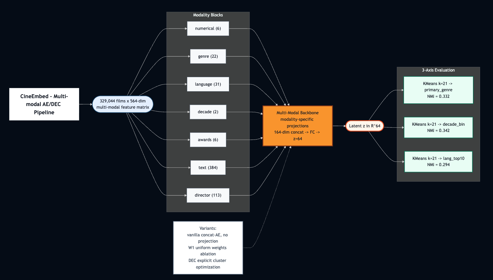
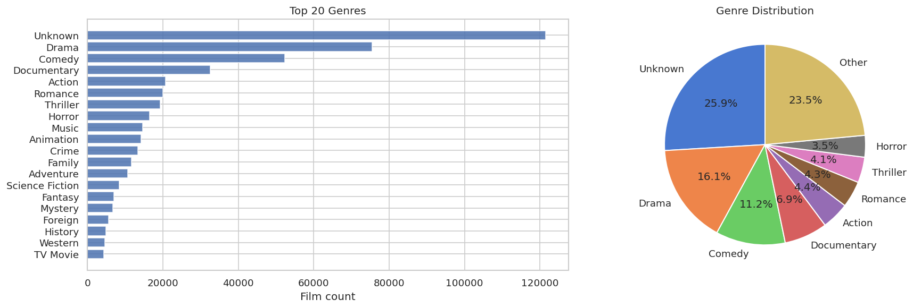
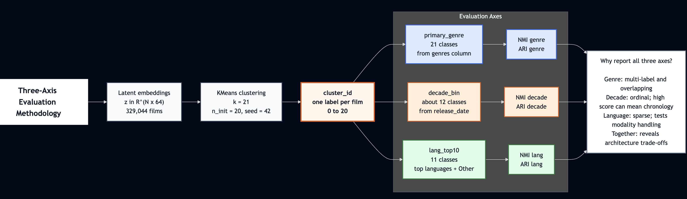
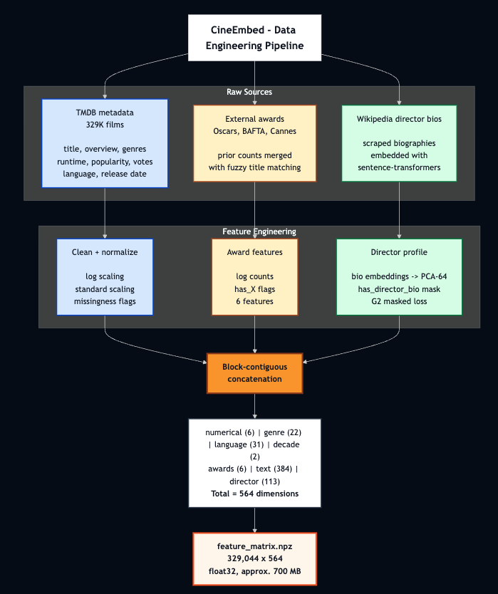
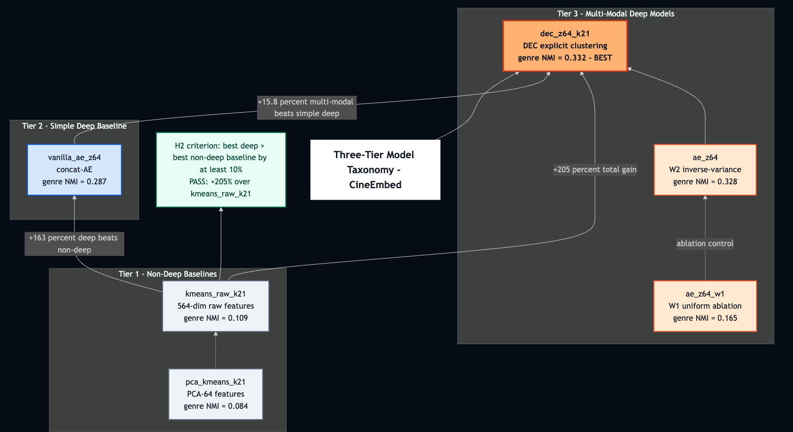
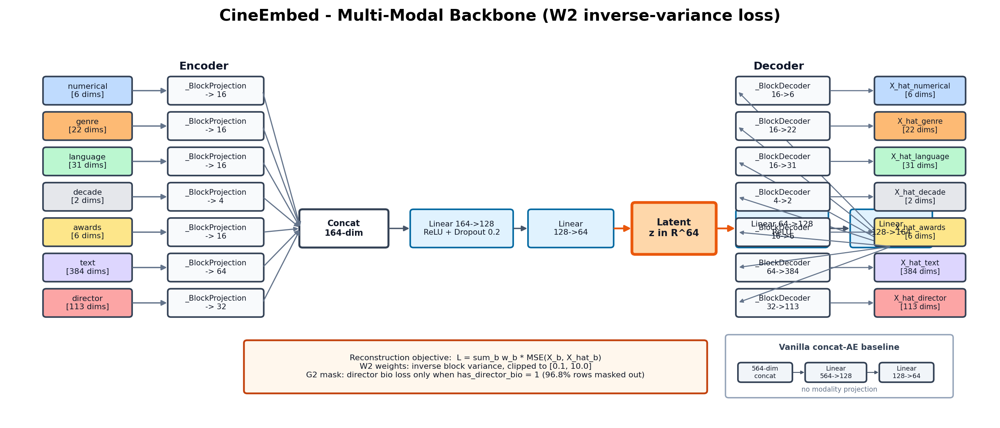
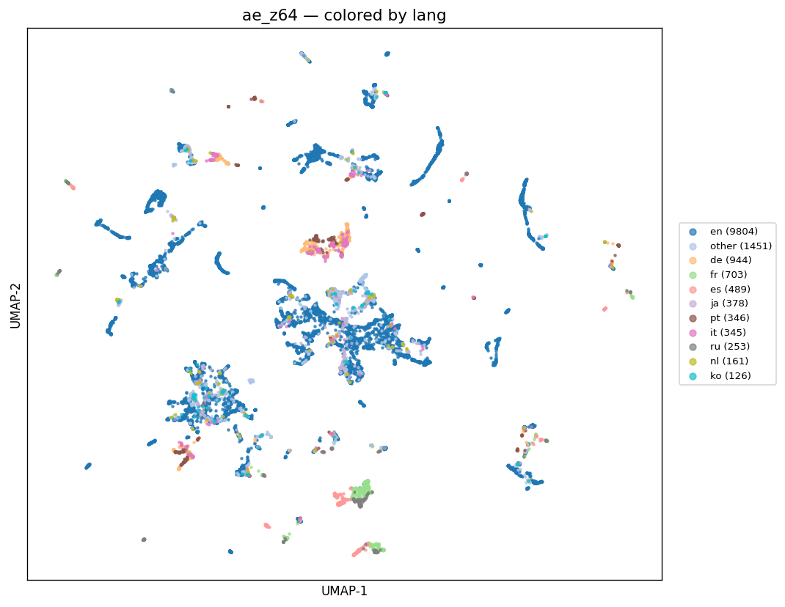
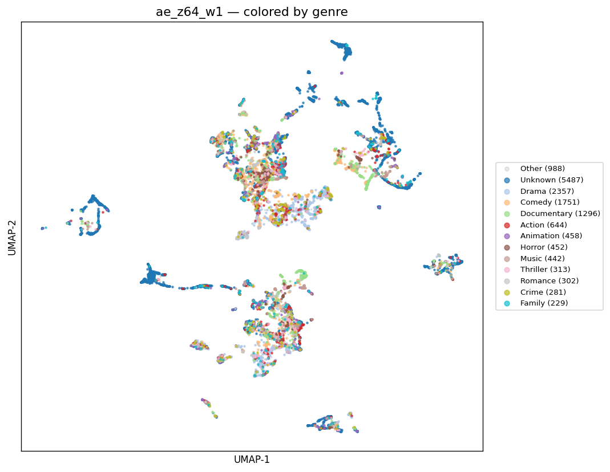
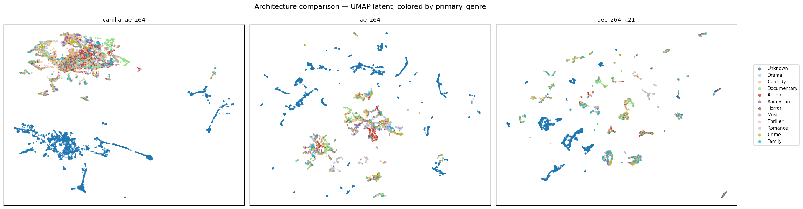
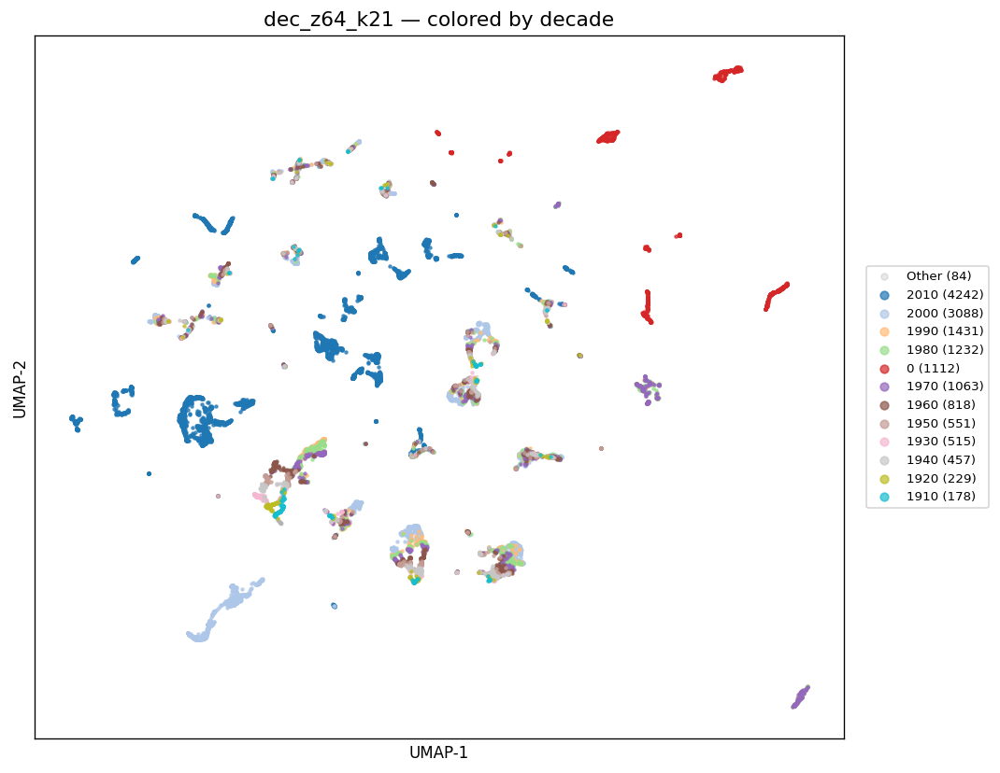

<!--
  CineEmbed — Intermediate Report Presentation
  SENG 474, Spring 2026, TED University
  Authors: Baran Dinçoğuz, Arda Arvas, Kaan Kaya

  Render to PDF:  marp PRESENTATION.md --pdf  --allow-local-files
  Render to PPTX: marp PRESENTATION.md --pptx --allow-local-files
  Render to HTML: marp PRESENTATION.md --html --allow-local-files
-->
---
marp: true
theme: default
size: 16:9
paginate: true
header: "CineEmbed — SENG 474 Intermediate Report"
footer: "Baran Dinçoğuz · Arda Arvas · Kaan Kaya · TED University · 2026"
style: |
  section { font-size: 22px; font-family: -apple-system, system-ui, "Segoe UI", sans-serif; }
  h1 { color: #C2410C; font-size: 36px; }
  h2 { color: #2563EB; font-size: 28px; }
  h3 { color: #15803D; font-size: 22px; }
  table { font-size: 18px; margin: 0 auto; }
  th { background: #F1F5F9; color: #1E293B; }
  strong { color: #C2410C; }
  .huge { font-size: 64px; font-weight: 700; color: #C2410C; line-height: 1; }
  .big  { font-size: 40px; font-weight: 700; color: #2563EB; }
  .ok   { color: #15803D; font-weight: 700; }
  .bad  { color: #B91C1C; font-weight: 700; }
  .grid2 { display: grid; grid-template-columns: 1fr 1fr; gap: 16px; }
  .grid3 { display: grid; grid-template-columns: 1fr 1fr 1fr; gap: 12px; }
  .small { font-size: 16px; color: #64748B; }
  .caption { font-size: 14px; color: #64748B; font-style: italic; text-align: center; }
  section.lead h1 { font-size: 48px; }
  section.lead h2 { font-size: 28px; color: #64748B; }
---

<!-- _class: lead -->

# CineEmbed
## Multi-Modal Unsupervised Embedding of 329,044 Films

**SENG 474 — Deep Learning, Spring 2026**
**Baran Dinçoğuz · Arda Arvas · Kaan Kaya · TED University**

<!--
Speaker notes:
- 90-second hook: heterogeneous movie metadata (TMDB + awards + Wikipedia bios) → 329K films, 564-dim feature matrix.
- Goal: learn 64-dim representations that recover three orthogonal label axes (genre, decade, language) without labels.
- Headline result: deep pipeline beats KMeans-on-raw by +205% on genre_NMI. All three pre-registered hypotheses pass.
- This is the modeling MVP closing the intermediate report; full study (VAE, k-sweep, ablations) reserved for the final report.
-->

---

## Problem & Motivation

**The data is heterogeneous, sparse, and partially missing.**

- **329,044 films** × **564 features** across **7 modality blocks**
- Genre is **multi-label and long-tailed** — 21 classes, top-3 dominate
- Language is **99% zero per row** (one language per film, 31 indicators)
- 96.8% of films have **no Wikipedia director bio** → masking required
- 7.4% of films have **no release date** → relevant later (Finding 9)

**Why it's hard:** KMeans on the raw 564-dim matrix treats `Δlog_popularity = 0.5` and `Δis_action = 0.5` as equally meaningful distances — they encode totally different things.

<!--
Speaker notes:
- Heterogeneity is the central challenge. Numerical, one-hot, sentence embeddings, awards counts — all in one matrix.
- Show genre distribution figure: "Drama and Comedy dominate; documentary subgenres are the long tail."
- The hard question: can deep representation learning produce a 64-dim space where Euclidean distance is meaningful across modalities? That's what we measure.
-->

---

## Three-Axis Evaluation, By Design

A **single ground-truth axis** would hide the trade-off this work is about.

We evaluate every model against three orthogonal label axes simultaneously:

- **`primary_genre`** — 21 classes (multi-label collapsed)
- **`decade_bin`** — ~12 buckets (1900s through 2020s + missing)
- **`lang_top10`** — 11 classes (top 10 + "other")

For each axis: cluster the 64-dim latent with **KMeans (k=21, n_init=20)**, then score with **NMI** (information overlap) and **ARI** (partition agreement).

→ **6 metrics per model, no axis privileged.**

<!--
Speaker notes:
- Justify the three-axis decision: a genre-only benchmark would have hidden our biggest architectural win (language) and our biggest regression (decade).
- KMeans k=21 matches genre cardinality; we acknowledge in the report that NMI is partition-cardinality-aware so the comparison across axes is honest.
-->

---

## Data Pipeline

**Three sources merged → 564-dim matrix.**

| Block | Dim | Notes |
|---|---:|---|
| numerical | 6 | log-popularity, runtime, vote |
| genre | 22 | 21-way one-hot + has_genre |
| language | 31 | top-30 langs (very sparse) |
| decade | 2 | decade_norm + has_release_date |
| awards | 6 | Oscar/BAFTA/Cannes log-counts |
| text | 384 | `all-MiniLM-L6-v2` embeddings |
| director | 113 | bio_pca_64 + lang/country/flags |

<!--
Speaker notes:
- Three input sources: TMDB, awards records, Wikipedia bios.
- The text block is 68% of the input dimensionality but variance per dim is small — this is exactly why W2 inverse-variance weighting matters.
- G2 masking: 96.8% of films have no bio, so we mask the bio_pca_64 reconstruction loss to avoid training the AE to predict zeros from zeros.
-->

---

## Three-Tier Model Taxonomy

We trained **6 models** spanning three tiers — designed so each tier isolates one source of the deep-vs-classical gap.

**Non-deep baselines**
- `kmeans_raw_k21` — KMeans on 564-dim
- `pca_kmeans_k21` — PCA-64 + KMeans

**Simple deep**
- `vanilla_ae_z64` — concat 564→128→64

**Multi-modal deep + ablations**
- `ae_z64` — 7 projections + W2 + G2
- `ae_z64_w1` — same arch, **W1 uniform**
- `dec_z64_k21` — `ae_z64` + DEC fine-tune

<!--
Speaker notes:
- Tier 1 vs Tier 2 isolates "deep vs not deep". Tier 2 vs Tier 3 isolates "modality projection vs not". Within Tier 3, W2 vs W1 isolates "inverse-variance weighting vs uniform". DEC vs AE isolates "explicit clustering vs not".
- Six models, four ablations, every comparison clean.
-->

---

## Multi-Modal Architecture

7 modality projections → concat (164-dim) → shared backbone → **z = ℝ⁶⁴**

**Loss (W2 inverse-variance, with G2 masking):**

$$\mathcal{L} \;=\; \sum_{b=1}^{7} w_b \cdot \mathrm{MSE}(X_b,\hat{X}_b),\quad w_b = \mathrm{clip}\!\left(\tfrac{1}{\mathrm{Var}(X_b)},\, 0.1,\, 10.0\right)$$

**DEC head:** Student-t soft-assignment over `k=21` centroids; total loss = `γ · KL(P‖Q) + L_recon`, γ=0.1.

<!--
Speaker notes:
- Modality projection sizes: text→64 (largest), numerical/genre/language/awards→16, director→32, decade→4. Total 164 dim concat.
- W2 weight clipping [0.1, 10.0] is a peer-review fix (D9) — prevents the language block from dominating early training before the encoder has learned anything.
- DEC P target computed batch-wise (D10), 10× speedup over full-dataset, no quality regression.
-->

---

## Results — Main Comparison Table

All 6 runs, z=64 latent, KMeans k=21:

| Tier | Run | genre_NMI | genre_ARI | decade_NMI | decade_ARI | lang_NMI | lang_ARI |
|---|---|---:|---:|---:|---:|---:|---:|
| Non-deep | `kmeans_raw_k21` | 0.109 | 0.063 | 0.233 | 0.093 | 0.075 | 0.026 |
| Non-deep | `pca_kmeans_k21` | 0.084 | 0.061 | 0.224 | 0.085 | 0.094 | 0.042 |
| Simple deep | `vanilla_ae_z64` | 0.287 | **0.247** | **0.369** | 0.175 | 0.095 | 0.030 |
| Ablation (W1) | `ae_z64_w1` | 0.165 | 0.094 | 0.367 | 0.176 | 0.070 | 0.026 |
| Multi-modal | `ae_z64` | 0.328 | 0.229 | 0.341 | **0.211** | 0.264 | 0.090 |
| **Best (DEC)** | **`dec_z64_k21`** | **0.332** | 0.244 | 0.342 | 0.210 | **0.294** | **0.090** |

**Bold = column winner. 6 metrics, 4 different winners — no model dominates.**
The non-uniformity is the principled-trade-off story.

<!--
Speaker notes:
- Don't read the whole table — point at it. The audience reads numbers faster than you can speak them.
- Key narration: "Notice that no single model wins all six metrics. Vanilla wins decade and genre_ARI; multi-modal wins decade_ARI; DEC wins three. That's the principled trade-off."
- All three pre-registered hypotheses (H1, H2, H3) pass — covered on slide 12.
-->

---

## Headline: Deep Beats Non-Deep By 3–5×

+205%

DEC `genre_NMI = 0.332` vs `kmeans_raw_k21 = 0.109`

**Genre NMI**
DEC vs kmeans_raw → **+205%**
DEC vs pca_kmeans → **+295%**

**Genre ARI**
DEC vs kmeans_raw → **+287%**
DEC vs pca_kmeans → **+300%**

**Language NMI**
DEC vs pca_kmeans → **+213%**
Multi-modal vs vanilla → **+178%**

→ Pre-registered **H2** (best-deep > 1.10 × best-non-deep): **PASS by an order of magnitude.**

<!--
Speaker notes:
- This is the single number to memorize: +205% on genre_NMI.
- Why so dramatic: KMeans on raw 564-dim treats "0.5 difference in log_popularity" and "0.5 difference in is_action" as equivalent distances. They aren't. Deep representation learning learns a space where Euclidean distance is meaningful across modalities. That's the gap classical methods cannot close.
- H2's threshold was +10% relative — we're at +205%. Spec was conservative; the gap was bigger than predicted.
-->

---

## Architecture Wins on Language (+178%) — and the Pareto Trade-Off

| Axis | vanilla | multi-modal | Δ |
|---|---:|---:|---:|
| `lang_NMI` | 0.095 | 0.264 | **+178%** |
| `genre_NMI` | 0.287 | 0.328 | +14% |
| `decade_NMI` | 0.369 | 0.341 | −7.6% |

**Why language wins so big:** modality projection allocates capacity to the 31-dim 99%-zero language block.
The vanilla concat-AE is dominated by the 384-dim text block.

**Why decade slightly loses:** capacity has to come from somewhere — the 2-dim decade signal is "easy", so the multi-modal model can afford to spend less on it.

→ **Principled trade-off, not a bug.**

UMAP of multi-modal latents, colored by top-10 language. Distinct micro-clusters per language family.

<!--
Speaker notes:
- The +178% language win is the architectural contribution proving its value.
- The −7.6% decade regression is what you should flag honestly — a single-axis benchmark would either falsely report uniform improvement (if it picked language) or hide the language win (if it picked decade).
- Implication for downstream: a recommender that cares about content+language similarity should use multi-modal latents. A recommender that only cares about era can do nearly as well with vanilla.
-->

---

## W2 Weighting Is Critical — W1 Collapse Visible

| Axis | W2 (`ae_z64`) | W1 (`ae_z64_w1`) | Δ |
|---|---:|---:|---:|
| `genre_NMI` | 0.328 | 0.165 | −50% |
| `lang_NMI` | 0.264 | 0.070 | −73% |
| `decade_NMI` | 0.341 | 0.367 | +8% |

Without inverse-variance weighting, **high-dim low-variance modalities lose all gradient signal** (text 384, language 31). The 2-dim decade block survives because StandardScaler already gave it variance ≈ 1.

**Diagnostic side-effect:** W1 early-stops at epoch 37 (vs 69 for W2). Patience exhaustion = "model gave up".

Same architecture, W1 uniform weighting. Diffuse blobs, no fine-structure. Compare to next slide.

<!--
Speaker notes:
- W1 is *not* a foolish baseline — it's a controlled ablation. Same architecture, same training schedule. Only the loss weighting differs.
- The fact that decade survives W1 collapse is itself diagnostic — it shows the failure mode is dimension-asymmetric, not a global broken-training event.
- Patience exhaustion at epoch 37 is a model-health signal, not a hyperparameter incident.
-->

---

## DEC Sharpens Boundaries — and Latent Topology Evolves

**DEC initialized from `ae_z64`, trained 21 epochs of KL+recon:**

| Metric | AE (init) | DEC | Δ |
|---|---:|---:|---:|
| `genre_NMI` | 0.328 | **0.332** | +1.2% |
| `genre_ARI` | 0.229 | **0.244** | **+6.6%** |
| `lang_NMI`  | 0.264 | **0.294** | **+11.4%** |

**ARI gain > NMI gain** = DEC tightens partitions, doesn't restructure. Diagnostic signature.

**Cluster health:** `total_reinit = 0` over 21 epochs.
All 21 KMeans++ centroids survived KL training without collapse.

Latent topology evolution: vanilla (2 mega-blobs) → multi-modal (dozens of islands) → DEC (tighter atomized islands).

<!--
Speaker notes:
- DEC's contribution is *cluster compactness*, not new structural information. The KL self-training tightens what AE has already discovered; it doesn't generate new latent variables.
- The diagnostic signature is "ARI gains more than NMI" — information content stays roughly fixed, but partition crispness improves.
- This 3-panel comparison figure is, for our money, the single most informative figure in the entire study. Modality projection creates structural diversity (panel 2), KL pressure sharpens it (panel 3).
-->

---

## Discovery: Missing-Data Manifold

In the DEC decade plot, films with `decade_bin = 0` (~7.4%, **missing release_date**) form an **isolated red cluster** in the upper-right.

The model **was not forced** to encode missingness as latent geometry — `has_release_date` is one binary input among 564.

Yet across all four deep architectures, "no release date known" emerges as a **dimension of latent geometry, not just a flag**. DEC compresses it into the cleanest partition.

**Not predicted by H1–H3.** This is a post-hoc representation-learning interpretability win.

**Practical:** latent-space queries naturally cluster missing-metadata films — useful for downstream data-quality triage.

DEC latent colored by decade. Red cluster top-right = films with missing release date.

<!--
Speaker notes:
- Frame this slide as bonus content: "While we were doing UMAP analysis for the report, we noticed something we hadn't predicted."
- The cluster is visible in vanilla and multi-modal too, but DEC's KL pressure makes it most explicit.
- The interpretability angle: representation learning surfaces structure the modeler didn't engineer for. That's the dividend.
-->

---

## Conclusion + Future Work

**All three pre-registered hypotheses PASS:**

- **H1** — DEC > AE on `genre_NMI`: ✅ 0.332 > 0.328 (+6.6% on ARI)
- **H2** — Best deep > 1.10 × best non-deep: ✅ **PASS by +205%**, an order of magnitude over threshold
- **H3** — Best deep `genre_NMI` > 0.15 floor: ✅ 0.332 ≫ 0.15

Plus a bonus post-hoc finding (missing-data manifold) not predicted by H1–H3.

**Best model:** `dec_z64_k21` — `genre_NMI=0.332`, `lang_NMI=0.294`, `decade_NMI=0.342`.

---

**Deferred for the final report:**
VAE family (z=32, 64, 128) · AE z-dim sweep · F1 (no-text) ablation · F2 (no-director) ablation · DEC k-sweep (9-cell grid) · W4 (Kendall learned uncertainty) · linear probing · 5-seed CIs · full reproducibility audit.

<!--
Speaker notes:
- Close on "all three hypotheses passed, plus a bonus" — high-confidence positive landing.
- Explicitly enumerate what's deferred so the audience knows the intermediate report is honest about scope, not pretending to be the full study.
- Best model is dec_z64_k21 — single number to remember from the talk: +205%.
-->
