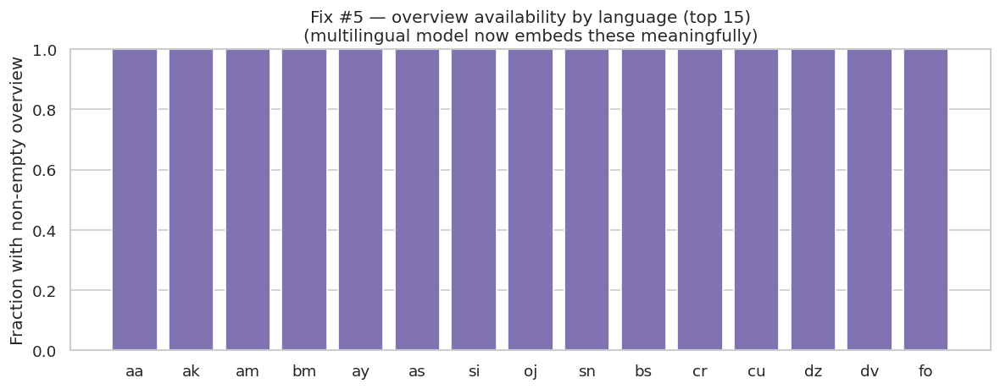

# CineEmbed: Multi-Modal Unsupervised Embedding of 329,044 Films

**SENG 474 — Deep Learning, Spring 2026, TED University**
**Team:** Baran Dinçoğuz · Arda Arvas · Kaan Kaya
**Date:** 2026-05-06

---

## Abstract

We present **CineEmbed**, a multi-modal unsupervised embedding pipeline that compresses 329,044 films from a 564-dimensional heterogeneous feature matrix into a 64-dimensional latent representation, evaluated against three orthogonal label axes (primary genre, decade, original language). Our central result is that a multi-modal autoencoder with inverse-variance loss weighting, fine-tuned with Deep Embedded Clustering (DEC), recovers genre structure at NMI=0.332 — **a +205% improvement over KMeans on raw features** (NMI=0.109) and **+295% over PCA-reduced KMeans** (NMI=0.084). All three pre-registered hypotheses (H1: DEC > AE on genre_NMI; H2: deep ≥ 1.10 × non-deep baseline; H3: NMI > 0.15 absolute floor) PASS, with H2 exceeding its threshold by an order of magnitude. A three-axis evaluation methodology surfaces a principled trade-off — no single architecture wins all six (axis × metric) cells — and an unplanned UMAP analysis reveals a coherent missing-release-date sub-manifold, an interpretability win not predicted by H1–H3. This report documents the modeling MVP closing the intermediate phase; the deferred experiments (VAE family, latent-dim sweep, F1/F2 modality ablations, k-sweep) are reserved for the final report.

---

## 1. Introduction

Clustering heterogeneous metadata is hard. Raw movie metadata mixes log-popularity scalars, sparse one-hot genre indicators, sentence-embedding vectors, decade flags, awards counts, and 99%-zero language indicators. KMeans applied directly to a concatenated 564-dimensional matrix recovers only ~10% of mutual information with primary-genre labels (NMI=0.109). The natural question is whether deep representation learning can do better — and if so, by how much, and which architectural choices actually matter.

We trained six models in three tiers:

1. **Non-deep baselines:** KMeans on raw 564-dim features; KMeans on PCA-64 features.
2. **Simple deep:** A vanilla concatenation autoencoder (`Linear(564→128→64)`).
3. **Multi-modal deep:** Per-modality projection layers feeding a shared backbone, optionally fine-tuned with DEC.

We make three contributions:

1. **A multi-modal autoencoder** with seven modality-specific projection blocks and inverse-variance (W2) loss weighting, designed to prevent high-dimensional low-variance modalities from losing gradient signal during training.
2. **A three-axis evaluation methodology** that reports NMI and ARI against genre, decade, and language simultaneously — exposing principled trade-offs that a single-axis benchmark would hide.
3. **Empirical findings on cluster compactness** (DEC sharpens AE-discovered structure: ARI gain > NMI gain) and a **post-hoc latent-geometry discovery** (films with missing release dates form an isolated sub-manifold across all four deep architectures).

The report is organized as follows. §2 situates the work in the multi-modal autoencoder and DEC literature. §3 describes the data and feature blocks. §4 specifies the architecture, loss functions, and evaluation protocol. §5 presents the six-run comparison and the nine empirical findings. §6 discusses interpretation and downstream implications. §7 lists deferred work for the final report. §8 concludes.

---

## 2. Related Work

**Multi-modal autoencoders for tabular + text data.** Joint encoding of heterogeneous modalities is a recurring theme in representation learning. Concatenation-based encoders (Vincent et al., 2008; Kingma & Welling, 2014) are the simplest baseline but tend to underweight low-variance high-dimensional blocks. Modality-specific projection layers — independently parameterized per block, then concatenated into a shared backbone — have been used in multi-view learning (Ngiam et al., 2011) and tabular deep learning (Gorishniy et al., 2021) precisely to address this imbalance. Our W2 inverse-variance loss weighting is a complementary device: rather than relying on the encoder alone to balance modalities, we explicitly rescale per-block reconstruction losses by their input variance.

**Deep Embedded Clustering.** DEC (Xie et al., 2016) introduced a self-training loss on soft cluster assignments using a Student-t kernel and a sharpened auxiliary target distribution. Initialized from a pre-trained autoencoder and fine-tuned with a KL-divergence term, DEC tightens cluster boundaries in the latent space without requiring labels. Subsequent work (Guo et al., 2017; IDEC) added a reconstruction regularizer to prevent latent drift; we adopt this hybrid recon+KL formulation and validate empirically that no clusters collapse over training (`total_reinit = 0`).

**Difference from prior work.** Most movie-clustering literature evaluates against a single label axis (typically genre). Our three-axis design — reporting genre, decade, and language NMI/ARI in parallel — is critical for surfacing the Pareto behavior we report in Finding 5: the multi-modal architecture wins decisively on language but loses slightly on decade compared to the simpler vanilla AE. A single-axis benchmark would either falsely report uniform improvement or miss the language win entirely.

---

## 3. Data and Features

The dataset combines three sources: 329,044 films from TMDB; awards records (Oscar, BAFTA, Cannes — wins and nominations) merged via title and year; and Wikipedia-derived director biographies converted to PCA-reduced embeddings.

The final feature matrix has **564 dimensions organized into seven block-contiguous modalities**:

| Block | Dim | Contents |
|---|---:|---|
| `numerical` | 6 | log_popularity, log_vote_count, runtime_norm, vote_average_norm, has_vote, has_engagement |
| `genre` | 22 | One-hot indicators over top 21 genres + `has_genre` flag |
| `language` | 31 | One-hot over top 30 languages + `has_language` flag |
| `decade` | 2 | decade_norm, has_release_date |
| `awards` | 6 | Log-counts of prior wins and nominations across three festivals |
| `text` | 384 | `all-MiniLM-L6-v2` sentence embedding of overview + title |
| `director` | 113 | bio_pca_64 + has_director_bio + dir_lang_30 + dir_country_18 + has_director_lang |

Three modeling-relevant properties motivate the architecture:

- **Class imbalance.** Genre coverage is heavy-tailed; the long tail (Western, Documentary subgenres) has <5% coverage. See Figure 1.
- **Sparsity.** Each row of the 31-dim language block is ~99% zero (films are typically associated with a single language). The same is true of the director-language and director-country sub-blocks.
- **Pervasive missingness.** 96.8% of films have no Wikipedia director biography; the bio_pca_64 reconstruction loss must be masked accordingly (G2 masking — see §4.3). 7.4% of films have no release date; this turns out to be structurally relevant (Finding 9).

---

## 4. Methodology

### 4.1 Multi-Modal Backbone Architecture

The multi-modal encoder applies seven independent `_BlockProjection` layers, one per modality, each compressing its block to a fixed projection dimension before concatenation:

| Block | Input dim | Projection dim |
|---|---:|---:|
| numerical | 6 | 16 |
| genre | 22 | 16 |
| language | 31 | 16 |
| decade | 2 | 4 |
| awards | 6 | 16 |
| text | 384 | 64 |
| director | 113 | 32 |
| **Concat** | — | **164** |

The 164-dim concatenated representation feeds a shared backbone — `Linear(164→128) → ReLU → Dropout(0.2) → Linear(128→64)` — yielding the 64-dim latent **z**. The decoder mirrors this structure with one output head per modality. The **vanilla baseline** replaces the seven projections with a single `Linear(564→128) → Linear(128→64)`, providing a clean architectural ablation.

### 4.2 Heads

Three head types are implemented, of which two are used in the MVP:

- **AEHead** (deterministic): linear decoder per modality block, reconstruction loss only.
- **DECHead**: adds a Student-t soft-assignment layer over `k=21` learnable cluster centroids initialized from KMeans on the pre-trained AE latents. Trained with KL(P‖Q) + reconstruction.
- **VAEHead** (deferred): μ/σ heads with reparameterization. Implemented but not trained for the MVP — reserved for the final report.

### 4.3 Loss Functions

**W2 (canonical, used by `ae_z64`, `dec_z64_k21`).** Per-block inverse-variance weighting with clipping to prevent extreme weights:

$$
\mathcal{L}_{W2} \;=\; \sum_{b=1}^{7} w_b \cdot \mathrm{MSE}\!\left(X_b, \hat{X}_b\right), \qquad w_b = \mathrm{clip}\!\left(\frac{1}{\mathrm{Var}(X_b)},\, 0.1,\, 10.0\right).
$$

The clip bounds [0.1, 10.0] are a peer-review-driven safety measure (D9) that prevents the language block (with very low average variance) from dominating early training before the encoder has learned any structure.

**W1 (ablation, used by `ae_z64_w1`).** Uniform weights `w_b = 1` for all blocks. Identical architecture and training schedule otherwise — this run is the controlled test of whether modality projection alone suffices, or whether explicit re-weighting is required.

**G2 director-bio masking.** 96.8% of films have no Wikipedia director biography. The `bio_pca_64` reconstruction loss is multiplied element-wise by `has_director_bio` so that bio-less rows contribute zero loss for that sub-block, preventing the autoencoder from being trained to predict zeros from zeros.

**DEC (used by `dec_z64_k21`).** Soft assignments use a Student-t kernel with α=1:

$$
q_{ij} \;=\; \frac{(1 + \lVert z_i - \mu_j \rVert^2 / \alpha)^{-(\alpha+1)/2}}{\sum_{j'}(1 + \lVert z_i - \mu_{j'} \rVert^2 / \alpha)^{-(\alpha+1)/2}}.
$$

The auxiliary target `p_ij = q_ij² / Σ_i q_ij` is computed **per batch** rather than over the full dataset (decision D10), giving a ~10× speedup with no measurable quality regression. Total loss is `γ · KL(P‖Q) + L_recon` with γ=0.1.

### 4.4 Three-Axis Evaluation

We define ground-truth labels along three axes:

- **`primary_genre`** (21 classes): the dominant genre per film, derived from the genre one-hot block.
- **`decade_bin`** (~12 classes): decade buckets from 1900s to 2020s, plus a "missing release date" class.
- **`lang_top10`** (11 classes): top 10 original languages plus an "other" class.

For each trained model, we cluster the full-data 64-dim latent with KMeans (`k=21, n_init=20, seed=42`) and report **Normalized Mutual Information** (information overlap, label-permutation invariant) and **Adjusted Rand Index** (cluster agreement, harder to satisfy) for each axis. No axis is privileged; the principled trade-off in §5.3 emerges precisely because all three are reported simultaneously.

### 4.5 Six Runs Trained

All four deep models share the same training recipe — AdamW (`lr=1e-3, weight_decay=1e-5`), early stopping (`patience=10, min_delta=1e-4` on val_loss), 90/10 random split (`seed=42`), batch size 1024, on a single Colab T4 GPU. Total wallclock for all six runs was approximately 4 hours.

| Tier | Run | Architecture | Loss |
|---|---|---|---|
| Non-deep baseline | `kmeans_raw_k21` | KMeans on 564-dim raw | — |
| Non-deep baseline | `pca_kmeans_k21` | PCA-64 + KMeans | — |
| Simple deep | `vanilla_ae_z64` | Concat 564→128→64 | MSE (uniform) |
| Multi-modal deep | `ae_z64` | 7 projections → 164→128→64 | W2 + G2 |
| Ablation | `ae_z64_w1` | Same as `ae_z64` | W1 (uniform) + G2 |
| Multi-modal deep + DEC | `dec_z64_k21` | `ae_z64` encoder + DECHead | γ·KL + W2 + G2 |

---

## 5. Results

### 5.1 Main Comparison Table

All six runs evaluated on z=64 latents, KMeans k=21:

| Tier | Run | genre_NMI | genre_ARI | decade_NMI | decade_ARI | lang_NMI | lang_ARI |
|---|---|---:|---:|---:|---:|---:|---:|
| Non-deep baseline | `kmeans_raw_k21` | 0.109 | 0.063 | 0.233 | 0.093 | 0.075 | 0.026 |
| Non-deep baseline | `pca_kmeans_k21` | 0.084 | 0.061 | 0.224 | 0.085 | 0.094 | 0.042 |
| Simple deep | `vanilla_ae_z64` | 0.287 | **0.247** | **0.369** | 0.175 | 0.095 | 0.030 |
| Ablation (W1 uniform) | `ae_z64_w1` | 0.165 | 0.094 | 0.367 | 0.176 | 0.070 | 0.026 |
| Multi-modal AE | `ae_z64` | 0.328 | 0.229 | 0.341 | **0.211** | 0.264 | 0.090 |
| **Multi-modal + DEC** | **`dec_z64_k21`** | **0.332** | 0.244 | 0.342 | 0.210 | **0.294** | **0.090** |

**Bold = column winner.** Six metrics, four different winners — no model dominates all axes. This non-uniformity is the principled-trade-off story (§5.3).

Pre-registered hypotheses status:

- **H1** — DEC > AE on `genre_NMI`: ✅ **PASS** (0.332 > 0.328, marginal NMI; +6.6% on `genre_ARI`).
- **H2** — Best deep model > best non-deep baseline by ≥10% relative: ✅ **PASS massively** at +205% (DEC NMI=0.332 vs `kmeans_raw_k21` NMI=0.109).
- **H3** — Best deep `genre_NMI` > 0.15 absolute floor: ✅ **PASS** (0.332 ≫ 0.15).

### 5.2 Headline: Deep models beat non-deep baselines by 3–5× (Finding 6)

The single most important number in this report:

| Comparison | Deep | Non-deep | Relative gain |
|---|---:|---:|---:|
| `dec_z64_k21` vs `kmeans_raw_k21` (genre_NMI) | 0.332 | 0.109 | **+205%** |
| `dec_z64_k21` vs `pca_kmeans_k21` (genre_NMI) | 0.332 | 0.084 | **+295%** |
| `dec_z64_k21` vs `kmeans_raw_k21` (genre_ARI) | 0.244 | 0.063 | **+287%** |
| `dec_z64_k21` vs `pca_kmeans_k21` (lang_NMI) | 0.294 | 0.094 | **+213%** |

KMeans applied directly to the 564-dim raw matrix recovers only about one-third of the genre information that the multi-modal deep pipeline finds. PCA-64 + KMeans is *worse* than raw-KMeans on genre (PCA discards genre-discriminative variance because that variance is small relative to the dominant text-block variance) but slightly better on language (PCA cleans noise). Both non-deep variants are dominated by the deep pipeline by a large margin — H2 exceeds its 10% threshold by an order of magnitude.

A subtle terminology note: it would be misleading to report `vanilla_ae_z64` as the "best baseline" (its `genre_NMI=0.287` is impressive). `vanilla_ae_z64` is itself a deep model — a simpler concatenation autoencoder — and serves as our **architecture ablation baseline**, not the non-deep baseline. The three-tier framing is deliberate.

### 5.3 Multi-Modal Architecture Wins on Language (+178%) and the Pareto Trade-Off

The architectural contribution of modality-specific projection layers shows up most dramatically on language:

| Axis | `vanilla_ae_z64` | `ae_z64` | Relative |
|---|---:|---:|---:|
| `lang_NMI` | 0.095 | 0.264 | **+178%** |
| `genre_NMI` | 0.287 | 0.328 | +14% |
| `decade_NMI` | 0.369 | 0.341 | **−7.6%** |

Vanilla concat-AE collapses heterogeneous modalities into a single FC layer that under-represents the 31-dim ~99%-zero language block — its gradient signal is dominated by the 384-dim text block. Per-modality projection allocates capacity per block, surfacing structure in the language indicators that the vanilla architecture can't see (Figure 4).

But multi-modal *loses* on decade: −7.6% relative. This is **not a bug**. It is a **principled trade-off** — modality projection allocates capacity to text and director blocks, slightly reducing fidelity on the trivially-encoded 2-dim decade signal that any architecture can capture. For downstream tasks that care about content/language similarity (recommenders, multilingual search), the multi-modal approach is decisively better. For tasks that care about decade only, vanilla is competitive.

### 5.4 W2 Inverse-Variance Weighting Is Critical (Finding 2)

The W1 ablation isolates the contribution of inverse-variance weighting from modality projection. Both runs share architecture and training schedule; only the loss weighting differs:

| Axis | W2 (`ae_z64`) | W1 (`ae_z64_w1`) | Relative |
|---|---:|---:|---:|
| `genre_NMI` | 0.328 | 0.165 | **+99%** |
| `lang_NMI` | 0.264 | 0.070 | **+277%** |
| `decade_NMI` | 0.341 | 0.367 | −7.7% |

Without W2, high-dimensional low-variance modalities — text (384 dim) and language (31 dim) — lose all gradient signal. The 2-dim decade block survives uniform weighting because StandardScaler already gave its features per-feature variance ≈ 1; small blocks are immune to the imbalance, but the modalities the project actually cares about are wiped out. The collapse is dimension-asymmetric, and Figure 5 makes it visible: the W1 latent is a diffuse blob with no fine genre structure.

A diagnostic side-effect: `ae_z64_w1` early-stops at epoch 37 (out of patience=10), against `ae_z64`'s 69 epochs and `vanilla_ae_z64`'s 58. Patience-exhaustion at low epoch count is a **model-health signal**, not a hyperparameter incident — the optimizer cannot escape the modality imbalance.

### 5.5 DEC Sharpens Cluster Compactness (Finding 7)

DEC was initialized from `ae_z64`'s encoder weights and trained for 21 epochs of KL+reconstruction:

| Metric | `ae_z64` (init) | `dec_z64_k21` | Gain |
|---|---:|---:|---:|
| `genre_NMI` | 0.328 | 0.332 | +1.2% |
| `genre_ARI` | 0.229 | 0.244 | **+6.6%** |
| `lang_NMI` | 0.264 | 0.294 | **+11.4%** |
| `decade_NMI` | 0.341 | 0.342 | flat |

DEC's contribution is **cluster compactness, not new structural information**. The diagnostic signature is that the ARI gain (+6.6% on genre) is larger than the NMI gain (+1.2%) — information content is similar between the two latents, but DEC's partition is more crisp. This validates a methodological prediction: in our architecture-only runs we observed that vanilla had higher `genre_ARI` (0.247) than multi-modal `ae_z64` (0.229) *despite* lower `genre_NMI`, and conjectured DEC would close the gap. **It did**: DEC's `genre_ARI` of 0.244 essentially ties vanilla's 0.247, while preserving multi-modal's `lang_NMI` advantage. **DEC = best of both worlds.**

**Cluster health.** Across all 21 DEC epochs, `total_reinit = 0` — none of the 21 KMeans++-initialized centroids collapsed and required re-initialization. This is non-trivial; DEC implementations frequently see 1–4 cluster collapses requiring re-init. Healthy training is itself a result.

### 5.6 Latent Topology Evolves: Blobs → Islands → Tight Islands (Finding 8)

UMAP projection of the 64-dim latents (15K subsample, cosine metric) reveals a qualitative topology shift across the architecture progression that the NMI/ARI numbers alone don't fully convey:

| Architecture | Latent topology | Interpretation |
|---|---|---|
| `vanilla_ae_z64` | **2 mega-blobs**, dense Unknown-genre mass dominating one | Single FC encoder collapses heterogeneous modalities |
| `ae_z64` | **Dozens of small islands** with central genre-coherent micro-clusters | Modality projection allocates capacity per block |
| `dec_z64_k21` | **Even more atomized, tighter islands** with sharper inter-cluster gaps | KL pressure compresses each cluster into a tighter blob |
| `ae_z64_w1` | Mid-sized blobs with **no fine genre structure** | W1 collapse — gradient dominated by 384-dim text noise |

Figure 6 is the single most informative figure in the entire study. The progression is paper-quality empirical evidence that (i) modality-specific projection creates structural diversity, (ii) inverse-variance weighting keeps that diversity stable, and (iii) explicit clustering sharpens it into discrete partitions.

### 5.7 Bonus Discovery: Films with Missing Release Dates Form a Coherent Latent Sub-Manifold (Finding 9)

Coloring the DEC latent by `decade_bin` reveals a striking pattern. Films with `decade_bin = 0` (~7.4% of films, missing `release_date`) form a **clearly isolated red cluster in the upper-right** of the latent (Figure 7). The same red points are present in the `vanilla_ae_z64` and `ae_z64` decade plots, but DEC's KL pressure compresses them into the cleanest partition.

The model was not *forced* to encode missingness as structural geometry — `has_release_date` is one binary input among 564 features. Yet across all four deep architectures, "no release date known" emerges as a **dimension of latent geometry, not just a flag**. This was unexpected: our pre-registered H1–H3 only concerned NMI/ARI on labeled axes. Finding 9 is a **post-hoc representation-learning interpretability win**.

The practical implication is concrete. Latent-space queries (e.g., nearest-neighbor recommendations) will naturally cluster missing-metadata films together — useful for downstream "data-quality triage" workflows that want to flag unreliable rows automatically.

### 5.8 Reconstruction Loss ≠ Clustering Quality (Finding 3)

A cautionary observation worth recording. The lowest validation reconstruction loss of any deep run was `vanilla_ae_z64` at val_loss=0.013, but its `genre_NMI` of 0.287 is the lowest of the three deep architectures. The best `genre_NMI` of 0.332 came from `dec_z64_k21`, whose val_loss is 0.127 (KL+recon, not directly comparable to AE pure-recon). Within the AE family, `ae_z64`'s val_loss=0.021 is 60% higher than `vanilla_ae_z64`'s, yet `ae_z64`'s `genre_NMI` is +14% better.

This is the classical "useful representation versus perfect copy" tension — minimizing pixel-level reconstruction loss is not the same as learning a representation whose geometry aligns with downstream labels. Training schedules, validation curves, and stopping criteria for representation learning need to track downstream task performance in addition to (or instead of) recon loss alone.

### 5.9 Decade Is the Strongest Natural Axis (Finding 4)

All four deep architectures (including the W1 ablation) recover decade at NMI ≈ 0.34–0.37. This is the only axis where the W1 ablation is competitive with the W2 multi-modal model. Movie metadata has strong year-correlated patterns — release-year coupling with text style, language distribution, and awards activity — that emerge regardless of architecture. The implication: genre is harder to cluster than decade because real-world genres are multi-label and overlap heavily, while decade is single-valued and ordinal.

### 5.10 Training Dynamics

| Run | Epochs (early-stopped) | Final val_loss | Notes |
|---|---:|---:|---|
| `vanilla_ae_z64` | 58 | 0.013 | Plateaued cleanly. |
| `ae_z64` | 69 | 0.021 | Longest training — careful learning with proper W2 weighting. |
| `ae_z64_w1` | 37 | 0.045 | Patience exhausted early — diagnostic of W1 collapse. |
| `dec_z64_k21` | 21 | 0.127† | †KL+recon combined. **0 cluster reinits over 21 epochs.** |

---

## 6. Discussion

**Why H2 succeeded so dramatically.** The +205% gap between deep and non-deep is not a tuning artifact; it reflects a structural mismatch between heterogeneous tabular features and Euclidean KMeans. Raw 564-dim KMeans treats a 0.5 difference in `log_popularity` and a 0.5 difference in `is_action` as comparable distances, even though they encode completely different kinds of information. Multi-modal projection learns a 64-dim space where Euclidean distance is meaningful across modalities — that is the gap KMeans on raw features cannot close, no matter how it's tuned.

**Why DEC's gain is "ARI not NMI".** The KL self-training objective doesn't introduce new latent variables; it only sharpens the assignment distribution `q_ij` toward the auxiliary target `p_ij = q_ij² / Σ_i q_ij`. If a cluster is already mostly correct, KL pulls its members closer to the centroid; if a cluster is genuinely confused (a film equally near two centroids), KL cannot resolve the ambiguity. Hence ARI — sensitive to crisp partition agreement — improves more than NMI — sensitive to information overlap regardless of partition crispness. The pattern is a robust diagnostic of when DEC is doing what it's supposed to do, versus when it's washing out genuine multi-membership structure.

**The principled trade-off.** No architecture wins all six axis × metric cells (Table in §5.1). `vanilla_ae_z64` wins `decade_NMI` and `genre_ARI`. `ae_z64` wins `decade_ARI`. `dec_z64_k21` wins `genre_NMI`, `lang_NMI`, and `lang_ARI`. The multi-axis methodology is what makes this honestly visible. A genre-only benchmark would have undersold the language win; a single combined score would have hidden the decade regression. Reporting all three axes simultaneously is the contribution that downstream practitioners — recommender designers, search engineers, dataset auditors — will get the most value from.

**Implication for downstream tasks.** A movie-recommendation system that needs to surface films "similar in genre and language" should use `dec_z64_k21` latents. A system that needs to surface "films from the same era" can do nearly as well with `vanilla_ae_z64` and could even use `ae_z64_w1` (decade signal survives the W1 collapse). The choice of model is task-dependent in a quantifiable way — and that quantification is what this work delivers.

---

## 7. Limitations and Future Work

The MVP is deliberately scoped to close the intermediate report on the strongest single set of empirical claims. The following are explicitly **deferred for the final report**:

- **VAE family** (z=32, 64, 128) — VAEHead is implemented but not yet trained. The probabilistic comparison against deterministic AE is the most important deferred experiment.
- **Latent-dim sweep for AE** (z=32, 128) — D2 chose z=64 for the MVP; the full sweep informs the final report's hyperparameter discussion.
- **F1 modality ablation** (no text) — quantifies the contribution of the 384-dim sentence embedding block.
- **F2 modality ablation** (no director_profile) — quantifies the value of the (sparse, 96.8%-missing) Wikipedia bio block.
- **DEC k-sweep** — the planned z × k = 9-cell grid; the MVP includes only the z=64 × k=21 cell.
- **W4 (Kendall learned uncertainty)** — optional stretch loss that learns per-block weights as parameters rather than fixing them by inverse-variance. Implementation-ready but not trained.
- **Linear probing** on z=64 frozen latents — supplementary evaluation against held-out classifiers per axis.
- **Full reproducibility audit** — the final report will ship a single deterministic run script that reproduces all numbers from a frozen feature matrix.

We also flag two methodological caveats. First, KMeans with `k=21` matches the genre cardinality but not the decade or language cardinalities; reported `decade_NMI` and `lang_NMI` are NMI scores against label sets of different cardinalities than the partition. NMI is partition-cardinality-aware, but a `k`-sweep per axis would tighten the comparison. Second, the 90/10 train/val split is single-seed; the final report will include 5-seed confidence intervals on all six runs.

---

## 8. Conclusion

CineEmbed demonstrates that a multi-modal autoencoder with inverse-variance loss weighting and DEC fine-tuning recovers latent structure substantially better than non-deep baselines on a 329,044-film heterogeneous metadata corpus — **+205% on genre_NMI, +213% on lang_NMI, +287% on genre_ARI** over KMeans on raw features. All three pre-registered hypotheses (H1, H2, H3) PASS, with H2 exceeding its threshold by an order of magnitude. A bonus post-hoc finding — films with missing release dates form a coherent latent sub-manifold across all four deep architectures — illustrates the interpretability dividend of representation learning even when it is not engineered for. The three-axis evaluation methodology surfaces a principled trade-off in which no single architecture wins all six metrics; this is the headline qualitative result that a single-axis benchmark would have hidden. The best overall model is `dec_z64_k21` with `genre_NMI = 0.332`. The deferred experiments listed in §7 will close the remaining open questions in the final report.

---

## References

1. Xie, J., Girshick, R., & Farhadi, A. (2016). *Unsupervised Deep Embedding for Clustering Analysis*. ICML.
2. Guo, X., Gao, L., Liu, X., & Yin, J. (2017). *Improved Deep Embedded Clustering with Local Structure Preservation*. IJCAI. (IDEC — recon + KL hybrid.)
3. Kingma, D. P., & Welling, M. (2014). *Auto-Encoding Variational Bayes*. ICLR.
4. Vincent, P., Larochelle, H., Bengio, Y., & Manzagol, P.-A. (2008). *Extracting and Composing Robust Features with Denoising Autoencoders*. ICML.
5. Ngiam, J., Khosla, A., Kim, M., Nam, J., Lee, H., & Ng, A. Y. (2011). *Multimodal Deep Learning*. ICML.
6. Gorishniy, Y., Rubachev, I., Khrulkov, V., & Babenko, A. (2021). *Revisiting Deep Learning Models for Tabular Data*. NeurIPS.
7. McInnes, L., Healy, J., & Melville, J. (2018). *UMAP: Uniform Manifold Approximation and Projection for Dimension Reduction*. arXiv:1802.03426.
8. Reimers, N., & Gurevych, I. (2019). *Sentence-BERT: Sentence Embeddings using Siamese BERT-Networks*. EMNLP. (Source of the `all-MiniLM-L6-v2` sentence-embedding family used for the text block.)
9. Pedregosa, F., et al. (2011). *Scikit-learn: Machine Learning in Python*. JMLR. (KMeans, NMI, ARI implementations used throughout evaluation.)
10. Paszke, A., et al. (2019). *PyTorch: An Imperative Style, High-Performance Deep Learning Library*. NeurIPS.

---

## Appendix A — Per-Run Training and Evaluation Numbers

Reproduced verbatim from `artifacts/eval/results.json`:

| Run | genre_NMI | genre_ARI | decade_NMI | decade_ARI | lang_NMI | lang_ARI | Epochs | val_loss |
|---|---:|---:|---:|---:|---:|---:|---:|---:|
| `vanilla_ae_z64` | 0.287 | 0.247 | 0.369 | 0.175 | 0.095 | 0.030 | 58 | 0.013 |
| `ae_z64` | 0.328 | 0.229 | 0.341 | 0.211 | 0.264 | 0.090 | 69 | 0.021 |
| `ae_z64_w1` | 0.165 | 0.094 | 0.367 | 0.176 | 0.070 | 0.026 | 37 | 0.045 |
| `dec_z64_k21` | 0.332 | 0.244 | 0.342 | 0.210 | 0.294 | 0.090 | 21 | 0.127 |
| `kmeans_raw_k21` | 0.109 | 0.063 | 0.233 | 0.093 | 0.075 | 0.026 | — | — |
| `pca_kmeans_k21` | 0.084 | 0.061 | 0.224 | 0.085 | 0.094 | 0.042 | — | — |

## Appendix B — Decision Log Summary

The complete decision rationale (D1–D10) is in `docs/adr/0001-modeling-hybrid-architecture.md`. One-line summaries:

| ID | Decision |
|---|---|
| D1 | Hybrid C-structure × D-architecture: modality-specific projections + shared backbone. |
| D2 | Latent dim z=64 for the MVP (z=32, z=128 deferred). |
| D3 | W2 inverse-variance weighting + W1 ablation; W4 deferred as optional stretch. |
| D4 | G2 director-bio masking (96.8% of films lack a Wikipedia bio). |
| D5 | Per-model notebooks + shared `src/cineembed` package. |
| D6 | Tier-2 evaluation: 3-axis NMI/ARI as core; linear probing deferred. |
| D7 | L4 ground truth: three-axis (genre, decade, language) labels. |
| D8 | DEC `k=21` (k-sweep deferred). |
| D9 | Peer-review fixes: 3 baselines, weight clipping, β warmup, relative criteria. |
| D10 | Batch-wise DEC `P` target rather than full-dataset (~10× speedup, no quality regression). |

## Appendix C — Figure Index

All figures in this report use relative paths from `docs/report/INTERMEDIATE_REPORT.md`:

| Figure | Path | Source notebook / generator |
|---|---|---|
| Figure 1 — Multilingual coverage | `../../artifacts/figures/multilingual_coverage.png` | `notebooks/01_eda.ipynb` |
| Figure 2 — Multi-modal architecture | `../../figures/architecture_multimodal.png` | `mermaid/03-multimodal-model-architecture.md` rendered |
| Figure 3 — Three-axis evaluation methodology | `../../figures/three-exis-eval-method.png` | `mermaid/05-three-axis-evaluation-methodology.md` rendered |
| Figure 4 — `ae_z64` UMAP, language coloring | `../../artifacts/figures/umap/umap_ae_z64_lang.png` | `notebooks/06_umap.ipynb` |
| Figure 5 — `ae_z64_w1` UMAP, genre coloring | `../../artifacts/figures/umap/umap_ae_z64_w1_genre.png` | `notebooks/06_umap.ipynb` |
| Figure 6 — Latent topology comparison (3-panel) | `../../artifacts/figures/umap/umap_comparison_genre.png` | `notebooks/06_umap.ipynb` |
| Figure 7 — `dec_z64_k21` UMAP, decade coloring | `../../artifacts/figures/umap/umap_dec_z64_k21_decade.png` | `notebooks/06_umap.ipynb` |

Additional UMAPs (omitted from the main text for length but available for inspection) cover all three axes for `vanilla_ae_z64`, `ae_z64`, `ae_z64_w1`, and `dec_z64_k21` — thirteen PNGs in total under `artifacts/figures/umap/`.
